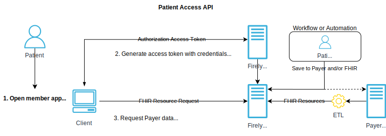
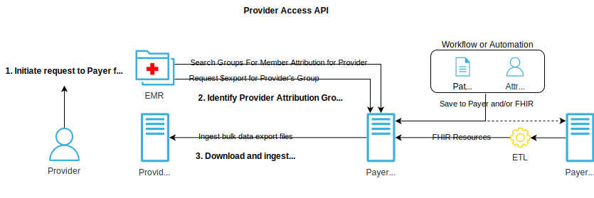
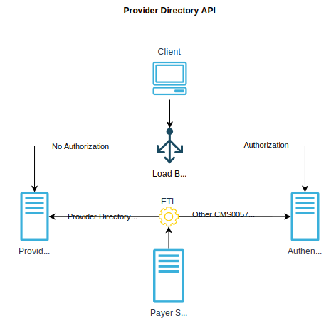

.. _cms:

CMS Interoperability and Prior Authorization Final Rule (CMS-0057-F) - 🇺🇸
=========================================================================

.. |PATACC| replace:: Patient Access API
.. |PROACC| replace:: Provider Access API
.. |PRODIR| replace:: Provider Directory API
.. |PRTOPR| replace:: Payor-to-Payor API
.. |PRAUTH| replace:: Prior Authorization API
.. |CARIN|  replace:: CARIN for Blue Button® IG Version STU 2.0.0
.. |SMART|  replace:: SMART App Launch IG Release 2.0.0 support Backend Services
.. |PDXIG|  replace:: Da Vinci Payer Data Exchange (PDex) IG Version STU 2.0.0
.. |PDRIG|  replace:: Da Vinci PDex US Drug Formulary IG Version STU 2.0.1
.. |PNTIG|  replace:: Da Vinci PDex Plan-Net IG Version STU 1.1.0
.. |CRDIG|  replace:: Da Vinci Coverage Requirements Discovery (CRD) IG Version STU 2.0.1
.. |DTRIG|  replace:: Da Vinci Documentation Templates and Rules (DTR) IG Version STU 2.0.0
.. |PASIG|  replace:: Da Vinci Prior Authorization Support (PAS) IG Version STU 2.0.1

The proposed `CMS Interoperability Rule (CMS-0057-F) <https://www.federalregister.gov/documents/2024/02/08/2024-00895/medicare-and-medicaid-programs-patient-protection-and-affordable-care-act-advancing-interoperability>`_ aims to promote greater interoperability, patient access, and innovation in the healthcare industry while also improving the quality and cost-effectiveness of care. Technically these goals are supported by multiple APIs that are required to be provided:

Firely Server supports all mandatory requirements out-of-the-box. The following implementation guides build the foundation of the APIs mentioned below.

.. list-table:: Firely Server Compliance CMS Interoperability Mandatory IGs
   :widths: 10, 10, 10, 10, 10
   :header-rows: 1
   
   * - API
     - FHIR v4.0.1
     - :ref:`us_core_ig`
     - :ref:`smart_app_launch_ig`
     - :ref:`bulk_data_access_ig`

   * - |PATACC|
     
     - ✅ 
     - ✅ 
     - ✅ 
     - Not needed
     
   * - |PROACC|
   
     - ✅ 
     - ✅ 
     - ✅ 
     - ✅ 
     
   * - |PRODIR|
   
     - ✅ 
     - ✅ 
     - ✅ 
     - Not needed
     
   * - |PRTOPR|
   
     - ✅ 
     - ✅ 
     - ✅ 
     - ✅ 
     
   * - |PRAUTH|
   
     - ✅ 
     - ✅ 
     - ✅ 
     - Not needed

.. list-table:: Firely Server Compliance CMS Interoperability Recommended IGs
   :widths: 10, 10, 10, 10, 10, 10, 10
   :header-rows: 1
   
   * - Implementation Guide
     - 
     - |PATACC|
     - |PROACC|
     - |PRODIR|
     - |PRTOPR|
     - |PRAUTH|

   * - |CARIN|

     - ☑️
     - ✅ 
     - ✅ 
     - ⚪
     - ✅
     - ⚪

   * - |SMART|
     
     - ☑️
     - ⚪ 
     - ✅ 
     - ⚪ 
     - ✅
     - ⚪

   * - |PDXIG|  
     
     - 
     - ✅ 
     - ✅ 
     - ⚪
     - ✅
     - ⚪

   * - |PDRIG|  

     - 
     - ✅
     - ⚪ 
     - ⚪
     - ⚪
     - ⚪

   * - |PNTIG|

     - ☑️
     - ⚪
     - ⚪ 
     - ✅
     - ⚪
     - ⚪

   * - |CRDIG|  

     - 
     - ⚪
     - ⚪ 
     - ⚪
     - ⚪
     - ✅

   * - |DTRIG|  

     - 
     - ⚪
     - ⚪ 
     - ⚪
     - ⚪
     - ✅

   * - |PASIG|  

     - 
     - ⚪
     - ⚪ 
     - ⚪
     - ⚪
     - ✅

☑️ = fully supported in the current release of Firely Server

.. note::
  There are additional Implementation Guides strongly recommended by CMS. Not all of them are currently supported by Firely Server. 

|PATACC|
------------------

Impacted payers (see `CMS definition <https://www.cms.gov/priorities/key-initiatives/burden-reduction/interoperability/faqs>`_) are required to make claims, encounter and clinical data, including laboratory results available through the Patient Access API.
The goal is to make as much data available to patients as possible through the API to ensure patients have access to their data in a way that will be most valuable and meaningful to them. The following information should be provided via Patient Access API using the corresponding implementation guides:

* Claim details and encounters (see :ref:`carin_ig`)
* Clinical data incl. laboratory data (see :ref:`us_core_ig` and Da Vinci Payer Data Exchange)
* Plan Coverage and Formularies (US Drug Formulary)
* Prior Authorization Decisions (Da Vinci Prior Authorization Support)

.. note::
  The Da Vinci Payer Data Exchange Implementation Guide and the CARIN Blue Button Implementation Guide both use the ExplanationOfBenefits. 
  The main difference in usage is that the CARIN profiles make information available about a final claim, whereas PDex aims for sharing prior authorization information.
  Additional details about the prior authorization decisions can be exposed via the PAS profiles.

To implement a Patient Access API it is necessary to:

  #. Enable SMART on FHIR and point Firely Server to an authorization server managing the accounts of the patients. See :ref:`feature_accesscontrol`.
  #. Expose the Patient record with all its USCDI, CPCDS, and prior authorization data elements
  #. Configure the API clients to be allowed to be granted access (read-only) to resources on behalf of the patient. See :ref:`Configuration of API clients in Firely Auth <firely_auth_settings_clients>`.

|PROACC|
-------------------

Impacted payers (see `CMS definition <https://www.cms.gov/priorities/key-initiatives/burden-reduction/interoperability/faqs>`_) are required to provide information exposed via a Patient Access API to providers who have a contractual relationship with the payer and a treatment relationship with the patient.
Providers could access information for an individual patient as well as a group of information, providing further insight into the patient's care activity at the point of care.

To implement a Provider Access API (Bulk) it is necessary to:

  #. Enable SMART on FHIR and point Firely Server to an authorization server managing the accounts of the providers. See :ref:`feature_accesscontrol`.
  #. Expose the Patient records with all its USCDI, CPCDS, and prior authorization data elements
  #. Maintain a member attribution lists for providers. It is necessary to account for patients who opted out of the information sharing process. See :ref:`davinci_atr_ig`.
  #. Configure the provider API clients to be allowed to be granted access (read-only) on behalf of the provider. See :ref:`Configuration of API clients in Firely Auth <firely_auth_settings_clients>`.
  #. Create access policies to restrict access to a member attribution group based on their Taxpayer Identification Numbers (TINs) and National Provider Identifiers (NPIs). See :ref:`feature_accesscontrol_permissions`.

|PRODIR|
-------------------

Impacted payers (see `CMS definition <https://www.cms.gov/priorities/key-initiatives/burden-reduction/interoperability/faqs>`_) are required  to provide a public-facing Provider Directory API containing data on contracted providers.
The API must include provider names, addresses, phone numbers, and specialties, with updates accessible within 30 days. While CMS doesn't specify how payers should handle API access for contracted networks, they must ensure the API is publicly accessible without requiring authentication. 
MA organizations offering MA-PD plans must provide pharmacy directory data, with CMS encouraging adherence to the PDex Plan-Net Implementation Guide. Developers accessing the Provider Directory API are not required to register, and its technical standards exclude authentication protocols. 
Payers need to ensure the API and its documentation are available through a public-facing digital endpoint on their website, with restrictions only allowed for necessary security measures.

To implement a |PRODIR| it is necessary to:

  #. Deploy an instance of Firely Server without security measures.
  #. Produce FHIR resources compliant with the `Da Vinci PDex Plan-Net IG Version STU 1.1.0 <https://hl7.org/fhir/us/davinci-pdex-plan-net/STU1.1>`_ Implementation Guide for storage in the unsecured Firely Server instance.
  
    * Extract resources from an existing Firely Server instance and/or generate resources from other payer systems.
    * Execute this resource generation process routinely and ensure updates are completed within 30 days of any modifications to the source data.

