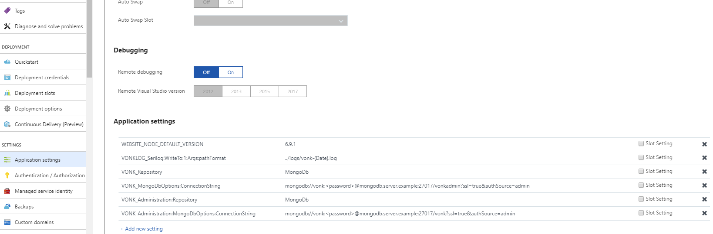

.. _azure_webapp:

Firely Server deployment on Azure Web App Service
=================================================

In this section we explain how you can deploy Firely Server in the Azure cloud. 

Getting started
---------------

Before you can run Firely Server, you will need to download the Firely Server binaries and request a license:

	1. Go to the Simplifier website, login and download the Firely Server binaries from https://simplifier.net/vonk/download
	2. Download the trial license file from the same location.
 
Deployment
----------

#. Go to Azure (https://portal.azure.com)  and create a web app:

   .. image:: ../images/Azure_01_CreateWebApp.png
      :align: center

#. Choose a name for the webapp, we will use the placeholder <webapp>. Fill in an existing resource group or create a new one and select Windows for the operation system (OS):

   .. image:: ../images/Azure_02_ChooseName.png
      :align: center

#. Add the trial license file (firelyserver-trial-license.json) to the firely-server-latest.zip by dragging the license file into the zipfile.
#. Open a webbrowser, navigate to ``https://<webapp>.scm.azurewebsites.net/ZipDeployUI`` and drag vonk_distribution.zip into the browser window. 
   This will install the Firely Server as a Web App in Azure.
   In our example the url is ``https://firelyserver.scm.azurewebsites.net/ZipDeployUI``
   This method of deployment does not work in Internet Explorer. It does work in Firefox, Chrome and Edge.
   Please make sure that after you have uploaded the .zip file, all content is extracted into the top-level webroot directory.
   
   .. image:: ../images/Azure_05_WebRoot.png
      :align: center
   
#. Open a browser and go to the site ``https://<webapp>.azurewebsites.net/`` . This will show the Firely Server home page.

Change database
---------------

In this example Firely Server is using a memory repository. If you want to change it to another kind of repository then you could change that on the page Application Settings of the Web App. Here you can set :ref:`Environment Variables<configure_envvar>` 
with the settings for either :ref:`SQL Server<configure_sql>` or :ref:`MongoDB<configure_mongodb>`. For example for MongoDB it will look like this:

More information
----------------
About Azure zip deployment: https://docs.microsoft.com/en-us/azure/app-service/app-service-deploy-zip#deploy-zip-file

