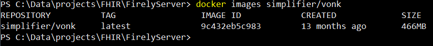
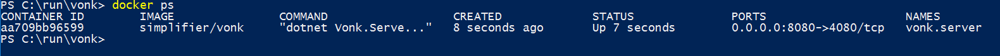
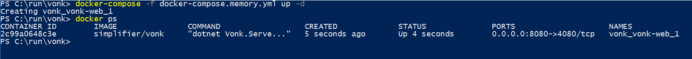

.. _use_docker:

=============================
Using Firely Server on Docker
=============================

We have created a Docker image for Firely Server, so you can run the server in any environment that supports Docker. For this section we
assume you have Docker installed on your system. If you want to install Docker for Windows, please read :ref:`docker_win` for specific
installation details.

.. _getting_started_docker:

Getting started
---------------

Before you can run Firely Server, you will need to pull the Docker Firely Server container and request a license.

1. Open your favourite command line tool and execute this command:
   ``> docker pull firely/server``

2. Go to the `Simplifier website <https://simplifier.net>`_, login and download your evaluation license.

3. Create a working directory for Firely Server and place the license file there.

.. warning:: If you use Docker, you may want to run multiple instances of Firely Server (e.g. with Kubernetes). Read :ref:`vonk_conformance_instances` for caveats with the Administration endpoint.

.. note:: Since Firely Server version 4.7.0, the Docker image name has changed from `simplifier/vonk <https://hub.docker.com/repository/docker/simplifier/vonk>`_ to `firely/server <https://hub.docker.com/r/firely/server>`_. The old image name will be maintained for a few months to allow for a smooth transition. When updating to version 4.7.0, you should start to use the new image name. Versions 4.6.2 and older will stay available (only) on 'simplifier/vonk'.

Running a Docker Firely Server in SQLite mode
---------------------------------------------

The easiest and the default way to run a Docker Firely Server container is to run Firely Server in SQLite repository mode. Note that this is not the most performant mode - see MongoDB and SQL Server options below for that.

Open your command prompt and execute this command:
``> docker images firely/server``

You will get a list that looks like:

Navigate to your working directory for Firely Server and run the container with this command:

- in cmd.exe: ``docker run -d -p 8080:4080 --name firely.server -v %CD%/firelyserver-license.json:/app/firelyserver-license.json firely/server``

- in Powershell: ``docker run -d -p 8080:4080 --name firely.server -v ${PWD}/firelyserver-license.json:/app/firelyserver-license.json firely/server``

If your license file has a different name, use that name instead of ``firelyserver-license`` on the left side of the `-v` parameter in the command above. E.g. ``-v ${PWD}/my-fancy-license.json:/app/firelyserver-license.json``

This will spin up a Firely Server container. It maps the host port 8080 to the container port 4080 with the switch ``-p 8080:4080``. It will give the
container the name firely.server with the switch ``--name firely.server``.
Furthermore it mounts the local licensefile into the ``/app`` directory, which is the directory where Firely Server resides in the container. Finally it will run the container in background mode with the switch ``-d``.

To test whether the container is running correctly, type the command:|br|
``> docker ps``

You can also take a look at the logs for Firely Server with:|br|
``> docker logs firely.server``

Open a browser and use the address ``http://localhost:8080/``. This will show the landing page of Firely Server.

To stop the container just type:|br|
``> docker stop firely.server``
|br| And to start it again:|br|
``> docker start firely.server``
|br| To completely remove the container:|br|
``> docker rm firely.server``

Adjust settings when running in a Docker container
^^^^^^^^^^^^^^^^^^^^^^^^^^^^^^^^^^^^^^^^^^^^^^^^^^

In the paragraph above we showed how to use ``-v`` to mount the license file into the app directory. We can use the same technique to mount a custom settings file or logsettings file. Or a directory to host the SQLite database outside of the container. Or have the logfile written to your working directory. Below is a full example using PowerShell. For creating ``appsettings.instance.json`` refer to :ref:`configure_appsettings`. For creating ``logsettings.instance.json`` refer to :ref:`configure_log`.

appsettings.instance.json
~~~~~~~~~~~~~~~~~~~~~~~~~

.. code-block:: JSON

   {
      "SQLiteDbOptions": {
         "ConnectionString": "Data Source=./resourcedata/vonkdata.db;Cache=Shared",
         "AutoUpdateDatabase": true
      }
   }

logsettings.instance.json
~~~~~~~~~~~~~~~~~~~~~~~~~

Settings for console and levels not included for brevity.

.. code-block:: JSON

   {
      "Serilog": {
         "WriteTo": [
            {
               "Name": "Async",
               "Args": {
                  "configure": [
                     {
                        "Name": "File",
                        "Args": {
                            "path": "./log/vonk.log",
                            "rollingInterval": "Day",
                            "fileSizeLimitBytes": "",
                            "retainedFileCountLimit": "7",
                            "outputTemplate": "{Timestamp:yyyy-MM-dd HH:mm:ss.fff zzz} {UserId} {Username} [{Application}] [{Level}] [Machine: {MachineName}] [ReqId: {RequestId}] {Message}{NewLine}{Exception}",
                            "restrictedToMinimumLevel": "Information"
                      }
                   }
                ]
              }
            },
         ],
         "Enrich": [ "FromLogContext", "WithMachineName", "WithThreadId" ],
         "Properties": {
            "Application": "Firely Server",
            "Environment": "Default"
         }
      }
   }

Powershell
~~~~~~~~~~

.. code-block::
   
   mkdir logs
   mkdir resourcedata //do not use 'data' - the administration database is already in that folder in the container
   //create the appsettings.instance.json above
   //create the logsettings.instance.json above
   
   docker run -d -p 8080:4080 --name firely.server `
   -v ${PWD}/firelyserver-license.json:/app/firelyserver-license.json `
   -v ${PWD}/appsettings.instance.json:/app/appsettings.instance.json `
   -v ${PWD}/logsettings.instance.json:/app/logsettings.instance.json `
   -v ${PWD}/resourcedata:/app/resourcedata `
   -v ${PWD}/log:/app/log `
   firely/server

You should see a ``vonkdata.db`` appear in the ``./resourcedata`` folder, and a log file in the ``./log`` folder. From here you can experiment with other settings. You can also easily keep different settings files side-by-side, mapping the one you want to test into the container, e.g. ``-v ${PWD}/some-weird-settings.json:/app/appsettings.instance.json``.

Mounting a your custom plugins folder into the container
^^^^^^^^^^^^^^^^^^^^^^^^^^^^^^^^^^^^^^^^^^^^^^^^^^^^^^^^

In a similar way as described above, you can mount your custom plugins into the container. However, this will replace the default plugings; they need to be added manually.

- Download the binaries of your server version from https://downloads.simplifier.net/firely-server/versions/
- Create a plugin folder, including the default plugins (extracted from the downloaded archive)
- Create ``appsettings.instance.json`` with the appropriate Pipeline section (see :ref:`vonk_plugins_config`)
- Mount the files and folder as shown below

.. code-block::
   
   docker run -d -p 8080:4080 --name firely.server `
   -v ${PWD}/firelyserver-license.json:/app/firelyserver-license.json `
   -v ${PWD}/appsettings.instance.json:/app/appsettings.instance.json `
   -v ${PWD}/plugins:/app/plugins `
   firely/server

The server is now accessible on ``http://localhost:8080/``.

Spinning up with a docker-compose file
^^^^^^^^^^^^^^^^^^^^^^^^^^^^^^^^^^^^^^
Another way to spin up a Firely Server container is to use a docker-compose file. The above example can also be established by the following ``docker-compose-sqlite.yml``:

.. code-block:: yaml
   :linenos:

   version: '3'

   services:

     vonk-web:
       image: firely/server
       ports:
         - "8080:4080"
       environment:
         - VONK_Repository=SQLite
         - VONK_Administration:Repository=SQLite
         - VONK_License:LicenseFile=./license/firelyserver-license.json
       volumes:
         - .:/app/license

Save the text above to a file in your working directory with the name ``docker-compose.sqlite.yml`` and then run the following command: |br|
``> docker-compose -f docker-compose.sqlite.yml up -d``

If your license file has a different name, use that name instead of ``firelyserver-license`` in the text above - but make sure to keep ``./license`` as that maps to a Docker volume inside the container.

To stop the container, run: |br|
``> docker-compose -f docker-compose.sqlite.yml down``

.. note::

    Strictly the settings for ``VONK_Repository`` and ``VONK_Administration`` are not needed here, since SQLite is the default setting. The settings are included to show where to configure the type of database to use.
    Much more information on that topic is in the paragraphs below.

Running Docker with a SQL Server container
------------------------------------------

Firely Server can use also other repositories than Memory, for example SQL Server. This section describes how to spin up a Firely Server container and a SQL Server container.
We will use docker-compose to achieve this.

.. warning:: SQL Server container uses at least 3.25 GB of RAM. Make sure to assign enough memory to the Docker VM if you're running on Docker for Mac or Windows.

.. warning:: If you also run the Administration database on SQL Server, please read :reF:`vonk_conformance_history`.

.. code-block:: yaml
   :linenos:

   version: '3'
   
   services:
     vonk-web:
       image: firely/server
       ports:
       - "8080:4080"
       depends_on:
         - vonk-sqlserver-db
       environment:
         - VONK_Repository=SQL
         - VONK_SqlDbOptions:ConnectionString=Initial Catalog=VonkData;Data Source=vonk-sqlserver-db,1433;User ID=sa;Password=SQLServerStrong(!)Password*
         - VONK_SqlDbOptions:SchemaName=vonk
         - VONK_SqlDbOptions:AutoUpdateDatabase=true
         - VONK_SqlDbOptions:AutoUpdateConnectionString=Initial Catalog=VonkData;Data Source=vonk-sqlserver-db,1433;User ID=sa;Password=SQLServerStrong(!)Password*
         - VONK_Administration:Repository=SQL
         - VONK_Administration:SqlDbOptions:ConnectionString=Initial Catalog=VonkAdmin;Data Source=vonk-sqlserver-db,1433;User ID=sa;Password=SQLServerStrong(!)Password*
         - VONK_Administration:SqlDbOptions:SchemaName=vonkadmin
         - VONK_Administration:SqlDbOptions:AutoUpdateDatabase=true
         - VONK_Administration:SqlDbOptions:AutoUpdateConnectionString=Initial Catalog=VonkAdmin;Data Source=vonk-sqlserver-db,1433;User ID=sa;Password=SQLServerStrong(!)Password*
         - VONK_License:LicenseFile=./license/firelyserver-license.json
       volumes:
         - .:/app/license
   
     vonk-sqlserver-db:
       image: microsoft/mssql-server-linux
       ports:
         - "1433:1433"
       environment:
         - ACCEPT_EULA=Y
         - SA_PASSWORD=SQLServerStrong(!)Password*
       healthcheck:
         test: /opt/mssql-tools/bin/sqlcmd -S localhost -U sa -P 'SQLServerStrong(!)Password*' -Q 'SELECT 1 FROM VonkData.sys.tables'
         interval: 1m30s
         timeout: 10s
         retries: 3
   
Save the text above to a file in your working directory with the name ``docker-compose.mssqlserver.yml``. Make sure your Firely Server license file is named
``firelyserver-license.json`` and is residing in your working directory (see :ref:`getting_started_docker` on how to obtain the license), **not** in a subdirectory named ``license`` (that is an internal directory inside the container).
If your license file has a different name, use that name instead of ``firelyserver-license`` in the text above.

Then use this command to spin up a Firely Server container and SQL container: |br|
``> docker-compose -f docker-compose.mssqlserver.yml up -d``

Open a browser and use the address ``http://localhost:8080/``. This will show the landing page of Firely Server.

.. warning:: Wait for about 2 minutes, because it takes a while to fire up the SQL container

Running Docker with a SQL Server on host
----------------------------------------

Another possibility is to run a Firely Server container with a SQL Server repository on the host. You will need a Microsoft SQL Server running on your host.
The version of SQL Server must at least be version 2012.

.. warning:: If you also run the Administration database on SQL Server, please read :reF:`vonk_conformance_history`.

To run the Firely Server container we will use the following docker-compose file:

.. code-block:: yaml
   :linenos:

   version: '3'

   services:
 
     vonk-web:
       image: firely/server
       ports:
         - "8080:4080"
       environment:
         - VONK_Repository=SQL
         - VONK_SqlDbOptions:ConnectionString=Database=VonkData;Server=my_host\<myInstanceName>;User ID=<myUser>;Password=<myPassword>
         - VONK_SqlDbOptions:SchemaName=vonk
         - VONK_SqlDbOptions:AutoUpdateDatabase=true
         - VONK_SqlDbOptions:AutoUpdateConnectionString=Database=VonkData;Server=my_host\<myInstanceName>;User ID=<DLLUser>;Password=<myPassword>
         - VONK_Administration:Repository=SQL
         - VONK_Administration:SqlDbOptions:ConnectionString=Database=VonkAdmin;Server=my_host\<myInstanceName>;User ID=<myUser>;Password=<myPassword>
         - VONK_Administration:SqlDbOptions:SchemaName=vonkadmin
         - VONK_Administration:SqlDbOptions:AutoUpdateDatabase=true
         - VONK_Administration:SqlDbOptions:AutoUpdateConnectionString=Database=VonkAdmin;Server=my_host\<myInstanceName>;User ID=<DLLUser>;Password=<myPassword>
         - VONK_License:LicenseFile=./license/firelyserver-license.json
       volumes:
         - .:/app/license
       extra_hosts:
         - "my_host:192.0.2.1"
 
Save the text above to a file in your working directory with the name ``docker-compose.mssqlserver_host.yml``. Before we spin up the container we have
to adjust the ``docker-compose.mssqlserver_host.yml``:

* On lines 11, 14, 16 and 19 the connection string to the database server is stated. Change the ``Server`` to your database server and instance name.
* Also change the ``User ID`` and ``Password`` on lines 11, 14, 16 and 19 to your credentials.
* Furthermore we have to tell Docker which IP address the host uses. This is done on line 24.
  In this case the host (named my_host) uses IP address 192.0.2.1. Change this to the appropriate address.

After saving your settings, make sure your Firely Server license file is named ``firelyserver-license.json`` and is residing in your working directory
(see :ref:`getting_started_docker` on how to obtain the license), **not** in a subdirectory named ``license`` (that is an internal directory inside the container). Or use the name of your license file instead of ``firelyserver-license`` in the text above.

You can run the Firely Server container as follows: |br|
``> docker-compose -f docker-compose.mssqlserver_host.yml up -d``

A database will automatically be created if is not already present on the database server. See :ref:`this page <overview_of_permissions>` for an overview of permissions the database user needs for creating the database and/or schema.

Open a browser and use the address http://localhost:8080/. This will show the landing page of Firely Server.

.. warning:: When you have a firewall installed on your host machine, it can block traffic from your Firely Server container to your host.
	Provide an inbound rule to allow traffic from the container to the host.

Run Docker with a MongoDB container
-----------------------------------

This section describes how to spin up a Firely Server container and a MongoDB container using a docker-compose. We assume you already have MongoDB installed.

.. warning:: If you also run the Administration database on MongoDb, please read :reF:`vonk_conformance_history`.

.. code-block:: yaml
   :linenos:

   version: '3'
	 
   services:
	 
     vonk-web:
       image: firely/server
       environment:
         - VONK_Repository=MongoDb
         - VONK_MongoDbOptions:ConnectionString=mongodb://vonk-mongo-db/vonkdata
         - VONK_MongoDbOptions:EntryCollection=vonkentries
         - VONK_Administration:Repository=MongoDb
         - VONK_Administration:MongoDbOptions:ConnectionString=mongodb://vonk-mongo-db/vonkadmin
         - VONK_Administration:MongoDbOptions:EntryCollection=vonkentries
         - VONK_License:LicenseFile=./license/firelyserver-license.json
       volumes:
         - .:/app/license
       ports:
         - "8080:4080"
	 
     vonk-mongo-db:
       image: mongo

Save the text above to a file in your working directory with the name ``docker-compose.mongodb.yml``. Make sure your Firely Server license file is named ``firelyserver-license.json``
and is residing in your working directory (see :ref:`getting_started_docker` on how to obtain the license), **not** in a subdirectory named ``license`` (that is an internal directory inside the container).
If your license file has a different name, use that name instead of ``firelyserver-license`` in the text above.

Use this command to spin up a Firely Server container and MongoDB container: |br|
``> docker-compose -f docker-compose.mongodb.yml up -d``

Open a browser and use the address http://localhost:8080/. This will show the landing page of Firely Server.

.. _license_as_environment_variable:

Providing license via an environment variable
---------------------------------------------

The examples above demonstrate how to provide a license by mounting a license file from the host's filesystem to the filesystem within a container. 
Starting from Firely Server v4.7.0, the license can also be provided as a string via an environment variable named ``VONK_License:LicenseString``.
This is meant to simplify deployments of Firely Server within Docker as you don't have to store the license file on the host's filesystem anymore.

The value of that variable should contain the same text as the license file but all in one line.

The example below shows how to spin up a Docker container by supplying the license as a variable.

.. code-block:: bash

  docker run -d \
    -p 8080:4080 \
    --name firely.server \
    -e "VONK_License:LicenseString={ 'LicenseOptions': { 'Kind': 'Production', 'ValidUntil': '2022-10-30', 'Licensee': 'example@fire.ly', 'Plugins': [ ... ] }, 'Signature': '...' }" \
    firely/server

If you use docker-compose, you can specify the variable in you docker-compose file like this:

.. code-block:: yaml
   :linenos:

   version: '3'

   services:

     vonk-web:
       image: firely/server
       ports:
         - "8080:4080"
       environment:
         - "VONK_License:LicenseString={ 'LicenseOptions': { 'Kind': 'Production', 'ValidUntil': '2022-10-30', 'Licensee': 'example@fire.ly', 'Plugins': [ ... ] }, 'Signature': '...' }"

.. |br| raw:: html

    
