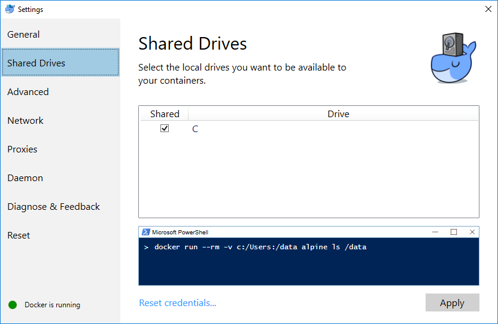
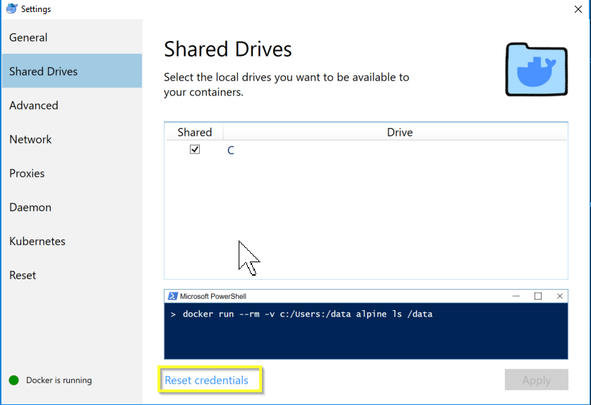
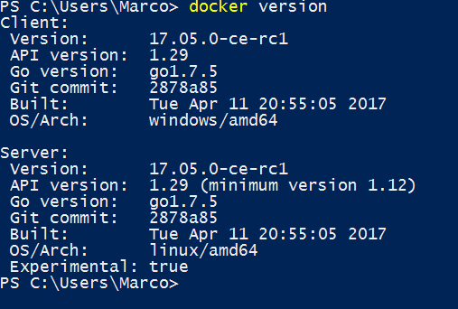
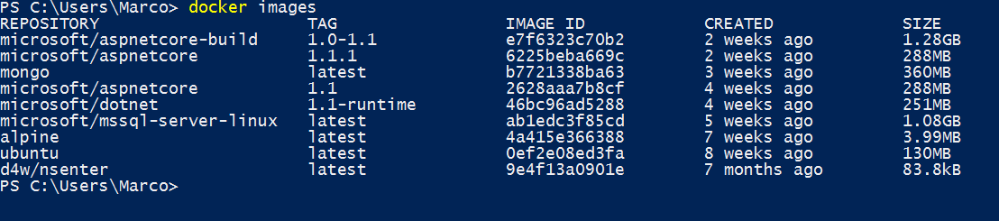

:orphan:

.. Part of docker.rst

.. _docker_win:

=============================
Installing Docker For Windows
=============================

To install Docker For Windows, look at `the official Docker pages`_ and please make sure you install
the Edge channel.

.. _docker_win_shared_drives:

Shared Drives
-------------

After installing, make sure that Shared Drives has been enabled.
To do this, open the settings for Docker for Windows and navigate to Shared Drives. Tick the drive you want to share and apply your settings:

More information about sharing drives can be found in the documentation on `Docker Shared Drives`_. 

If you have shared your drives before, please check whether the credentials are still valid. If you have changed your Windows password since, you will also have to update the credentials in Docker for Windows.

.. _docker_win_linux_containers:

Linux Containers
----------------

Firely Server Docker containers are *Linux* Containers, not Windows Containers. So make sure Docker for Windows is using Linux Containers. See the documentation on `Docker switching Container type`_ if needed. 

Check
-----

To test the installation, open your favorite command line tool and type the following command:

``> docker version``

This will result in the following:

  
To show which images are located on your machine, type:
 
``> docker images``
 

 
This example shows you a number of images. When you have just installed Docker For Windows, you probably won't have any images located on your machine.

.. _Docker switching Container type: https://docs.docker.com/docker-for-windows/#switch-between-windows-and-linux-containers

.. _the official Docker pages: https://docs.docker.com/docker-for-windows/install

.. _Docker Shared Drives: https://docs.docker.com/docker-for-windows/#shared-drives
