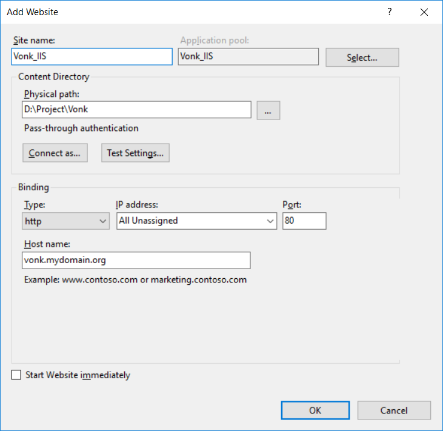
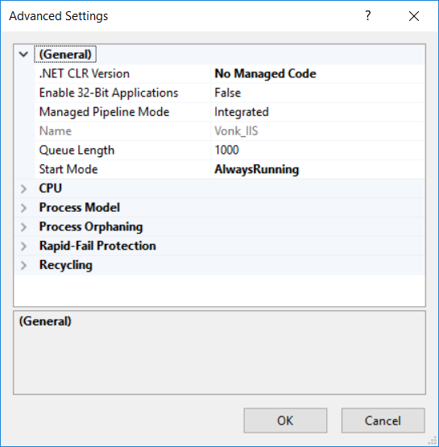
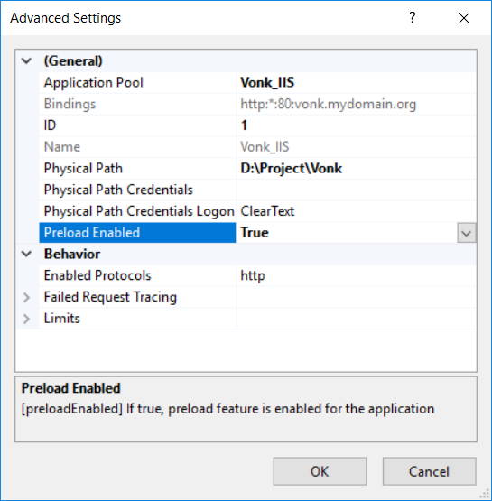
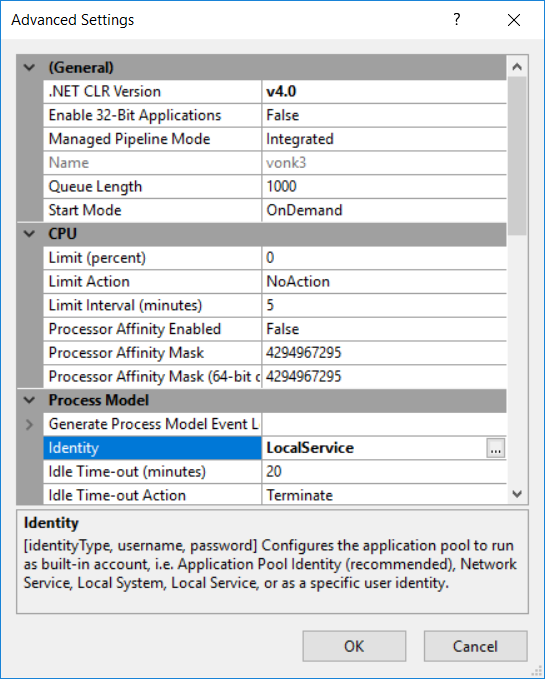

:orphan:

.. Part of reverseProxy.rst

.. _iis:

===========================
Deploy Firely Server on IIS
===========================

Prerequisites
-------------

1. The following operating systems are supported: Windows 7 or Windows Server 2008 R2 and later   

2. Have IIS windows feature turned on on the hosting machine. 
   You can do this in **Control Panel** -> **Programs and Features** -> **Turn Windows features on or off** .
   You need to check **Internet Information Services** -> **Web Management Tools** -> **IIS Management Console** 
   and **Internet Information Services** -> **World Wide Web Services** to accept the default features or customize IIS to fit your needs.
  
   .. image:: ../../images/iis_turn_windows_features_on.png
      :align: center   

3. In order to have IIS start the Firely Server right away, you will have to enable the "Application
   Initialization" setting:
  
   .. image:: ../../images/iis_enable_application_init.png
      :align: center      
   
4. To enable PUT and DELETE interactions, you will have to turn off WebDAV:

   .. image:: ../../images/iis_disable_webdav.png
      :align: center   

   See https://stackoverflow.com/questions/6739124/iis-7-5-enable-put-and-delete-for-restful-service-extensionless for
   some background information. If you do not want to disable WebDAV for all of IIS, you can also disable it just for Firely Server
   using a setting in *web.config*, see :ref:`web_config`.
   
5. Choose a solution to deploy/move the application to the hosting system. 
   Multiple alternatives exist like Web Deploy, Xcopy, Robocopy or Powershell. 
   One popular choice is using Web Deploy in Visual Studio. For using that you will need to install 
   Web Deploy on the hosting system. To install Web Deploy, you can use the Web Platform Installer 
   (https://www.microsoft.com/web/downloads/platform.aspx).

6. Install the `.NET Core Runtime & Hosting bundle <https://dotnet.microsoft.com/download/dotnet-core/3.1>`_ on the hosting system. After installing it, you may need to do a “net stop was /y” and “net start w3svc” to ensure all the changes are picked up for IIS. The bundle installs the .NET Core Runtime, .NET Core Library, and the ASP.NET Core Module. ASP.NET Core Module (ANCM) allows you to run ASP.NET Core applictions using Kestrel behind IIS. For more information about ANCM check https://docs.microsoft.com/en-us/aspnet/core/fundamentals/servers/aspnet-core-module

6. Prepare binaries. You can either download the binaries for Firely Server (see :ref:`vonk_getting_started`), or create your own solution by building a facade.

If you are deploying a Firely Server facade in your own web server application, take the additional following prerequisites into consideration:
   
   - Make sure you use the **IISIntegration NuGet** package. You can install this as part of one of the metapackages (``Microsoft.AspNetCore`` and ``Microsoft.AspNetCore.All``) or independently  ``Microsoft.AspNetCore.Server.IISIntegration``. This is needed for the interoperability between Kestrel and ANCM.

   - Provide a *web.config* file for configuring the ANCM module or make sure the selected deploy options generates one for you. Using **dotnet publish** or **Visual studio publish** would generate a *web.config* for you. Check https://docs.microsoft.com/en-us/aspnet/core/hosting/aspnet-core-module for guidance on configuring the ANCM.

Create Website in IIS
----------------------

1. Publish the application to a location on the host server, using the solution selected in the Prerequisites step 3.

2. In IIS Manager create a new website or a new application under existing IIS site. Fill the **Site name**, the **Binding** and link the **Physical path** to the folder created in the previous step, similar to the picture below. The bindings defined in IIS override any bindings set in the application  by calling either Listen or UseUrls. 

3. Edit the application pool to set the **.NET CLR VERSION** to **NO Managed Code**, similar to the picture below (we use  IIS as a reverse proxy, so it isn’t actually executing any .NET code). To edit the application pool, go to the **Application Pools** panel, right-click the website's app pool and select **Advanced Settings...** from the popup menu.

.. attention::
   IIS will pause a website if it is idle for a while. Pausing a dotnet process is the same as shutting
   it down, so this means that IIS shuts down the Firely Server. |br| This causes problems with each first request that is sent to Firely Server after an idle period. Firely Server needs a couple of seconds to start up
   again, and answers with a ``423 Lock Error`` while it loads.  
   Make sure to set **Start Mode** to **AlwaysRunning** to prevent IIS from shutting down Firely Server.

4. Go to your IIS Sites, and click on your Firely Server website. On the right, choose **Advanced settings...**.
   |br| Set **Preload Enabled** to **True** to make IIS load the Firely Server right away, instead of on
   the very first request. Otherwise this first request results in a ``423 Lock Error`` as described
   above.

.. _web_config:

Configuration
-------------
- You can use *web.config* to configure ASP.NET Core Module and IIS using the  <system.webServer> section. 
  Read more about configuring ANCM at https://docs.microsoft.com/en-us/aspnet/core/hosting/aspnet-core-module.

- If you need to disable WebDAV for Firely Server, so you can perform PUT and DELETE interactions, add this to the
  *web.config* file:

  ::

    <modules>
      <remove name="WebDAVModule" />
    </modules>
    <handlers>
      <remove name="WebDAV" />
    </handlers>

- You can configure the Firely Server using the appsettings.json file (see :ref:`configure_vonk`).

- If you are building a Firely Server facade, you can use IISOptions to configure IISIntegration service options. You can read more about IISOptions at
  https://docs.microsoft.com/en-us/dotnet/api/microsoft.aspnetcore.builder.iisoptions?view=aspnetcore-2.0.

  ::

    services.Configure<IISOptions>(options => 
    {
        ...
    });

  
SQL 
-------------
In order to use the Sql Repository option in IIS you should make sure that the identity of the IIS application pool has rights to use the database considering the provided connection string. 
To change the identity the application pool is using open IIS ➡️ Application Pools ➡️ select your application pool ➡️ right click and select "Advanced Settings..."
You should see something similar to the image below:

  
  
.. |br| raw:: html

    

Extra
------------
If you'd like to set Firely Server environment variables via an Azure pipelines task, you can do so by setting the application pool's environment variables. For example, to pass the variable ``TEST`` to Firely Server that's housed in the ``fhir`` application pool, do the following: ::

      %systemroot%\system32\inetsrv\APPCMD set config -section:system.applicationHost/applicationPools /-"[name='fhir'].environmentVariables.[name='VONK_TEST']" /commit:apphost
      %systemroot%\system32\inetsrv\APPCMD set config -section:system.applicationHost/applicationPools /+"[name='fhir'].environmentVariables.[name='VONK_TEST',value='some_value_here']" /commit:apphost
      
See also :ref:`configure_envvar`.
