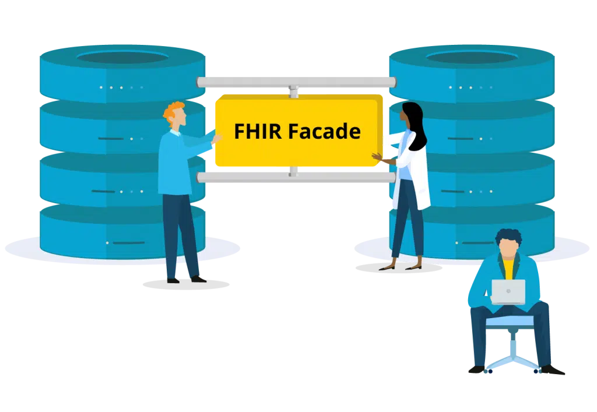

.. _vonk_facade:

Firely Server Facade
====================

Firely Server Facade is a means to use the Firely Server implementation of the FHIR RESTful API on top of an existing repository.
This repository may be a relational database, a nosql database or even another web api.

This chapter details the two options for setting up a Firely Server Facade, and provides you with an exercise to get
some hands-on experience with a Facade solution.

.. toctree::
   :maxdepth: 1
   :titlesonly:

   setup
   facadestart
   prerequisites
   projectsetup
   databasemodel
   enablesearch_1
   Next search step <enablesearch_2>
   finalizesearch
   debugging
   finalizeproject
   enablechange_1
