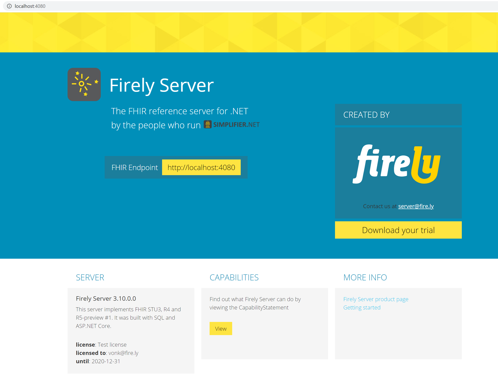

.. _vonk_getting_started:

===============
Getting Started
===============

If you want to start using the standard Firely Server in your own Windows environment, follow the steps on this page to install
and run the server. |br|
For non Windows systems, or if you want to use Docker for Windows, please look at the :ref:`use_docker` section.

1.	Download the Firely Server binaries and the license file from `Simplifier.net <https://simplifier.net/vonk>`_.
	
2.	Extract the downloaded files to a location on your system, for example: :code:`C:\FirelyServer`. We will call this the 
	working directory.

3.	Put the license file in the working directory.

4.	In the working directory create a new JSON file and name it ``appsettings.json``. 
	You will use this file for settings that you want to differ from the defaults in ``appsettings.default.json``.
	For more background on how the settings are processed, see :ref:`configure_appsettings`

5.	Open ``appsettings.json``, copy the ``LicenseFile`` setting from ``appsettings.default.json`` to it and change this property to the name of your license file. For example
::

    "License": {
        "LicenseFile": "firelyserver-trial-license.json"
    }

.. important:: 
	
	The next step assumes you have a .NET Core environment installed. If not, please 
	`download and install <https://dotnet.microsoft.com/en-us/download/dotnet/6.0>`_ **ASP.NET Core Runtime 6.x.xx Hosting Bundle** before you continue.
	Choose the latest security patch to mitigate security issues in previous versions.

6.	Open a command prompt or Powershell, navigate to the working directory and run:
	:code:`> dotnet .\Firely.Server.dll`

	Firely Server will then run on port 4080 of the system.
	
7.	If you want to check if Firely Server is running correctly, open a browser and go to :code:`localhost:4080`.
	You should see a homepage similar to this:
   

Please note that the third example query ``/Patient/example`` will only work if you first PUT a Patient with the id 'example'.
You can get this `example from the specification <http://www.hl7.org/implement/standards/fhir/patient-example.json>`_.

Configuration
-------------

The section :ref:`configure_vonk` explains how you can configure the Firely Server.

.. _vonk_run:

Running the server
------------------

When you have completed your configuration changes, you can run the server.
Open a command prompt or Powershell, navigate to your working directory and run:
::

	> dotnet .\Firely.Server.dll

.. |br| raw:: html

    
