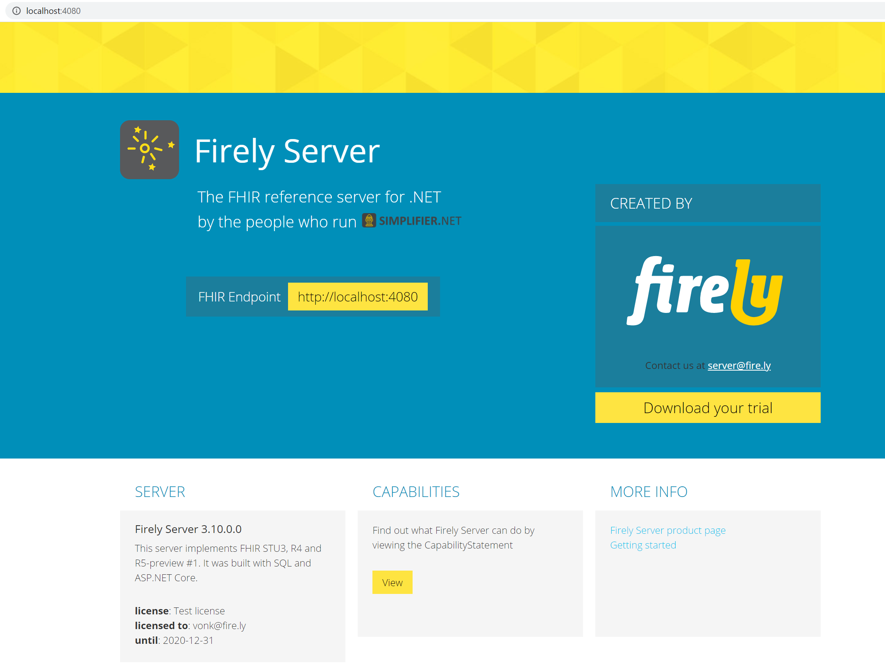

.. _vonk_getting_started:

===============
Getting Started
===============

The following pages will provide you with the first stepping stones when starting to work with Firely server. 
You can install Firely Server locally in a matter of minutes for testing purposes.

.. _yellowbutton:

If you are interested in using a project on `Simplifier <https://docs.fire.ly/projects/Simplifier/>`_ for your conformance resources, you can also quickly spin up a Firely Server instance with the content of this project already loaded. For more information how to do this please see :ref:`Use Firely Server with your Simplifier artifacts <simplifier_docs:simplifier_firely_server>`.

.. _vonk_basic_installation:

Basic installation
-----------------

.. note::
	Firely Server can run on all operation systems that support .NET. If your OS does not support .NET or if you want to use Docker, 
	please look at the :ref:`use_docker` section.

If you want to start using the standard Firely Server in your local environment, follow the steps on this page to install
and run the server. |br|

1.	Sign up for an `evaluation license <https://fire.ly/firely-server-trial/>`_. You will receive an email with the license file as well as a link to the `download page <https://downloads.fire.ly/firely-server>`_ were you can download the Firely Server binaries with the version of your choosing.
	
2.	Extract the downloaded files to a location on your system, for example: :code:`C:\FirelyServer`. We will call this the 
	working directory.

3.	Put the license file in the working directory.

4.	In the working directory create a new JSON file and name it ``appsettings.json``. 
	You will use this file for settings that you want to differ from the defaults in ``appsettings.default.json``.
	For more background on how the settings are processed, see :ref:`configure_appsettings`

5.	Open ``appsettings.json``, copy the ``LicenseFile`` setting from ``appsettings.default.json`` to it and change this property to the name of your license file. For example:
	::

		{
		  "License": {
			"LicenseFile": "firelyserver-trial-license.json"
		  }
		}

1. You can further configure Firely Server by adjusting the ``appsettings.json``. The section :ref:`vonk_setup_FS` explains possible configuration settings.

.. _vonk_run:

Running Firely Server
---------------------

.. important:: 
	
	The next step assumes you have a .NET Core environment installed. If not, please 
	`download and install <https://dotnet.microsoft.com/en-us/download/dotnet/8.0>`_ **ASP.NET Core Runtime 8.x.xx Hosting Bundle** before you continue.
	Choose the latest security patch to mitigate security issues in previous versions.

When you have completed your configuration changes, start the server.
Open a command prompt or Powershell, navigate to your working directory and execute:
::

	> dotnet .\Firely.Server.dll

.. |br| raw:: html

    
   
Access Firely Server
--------------------

Firely Server will by default run on port 4080 of the system. Check if Firely Server is running correctly, open a browser and navigate to :code:`localhost:4080`.
	
You will see the following homepage:
   

|br|
The next step is to explore Firely Server functionality, see :ref:`vonk_features` for more details.