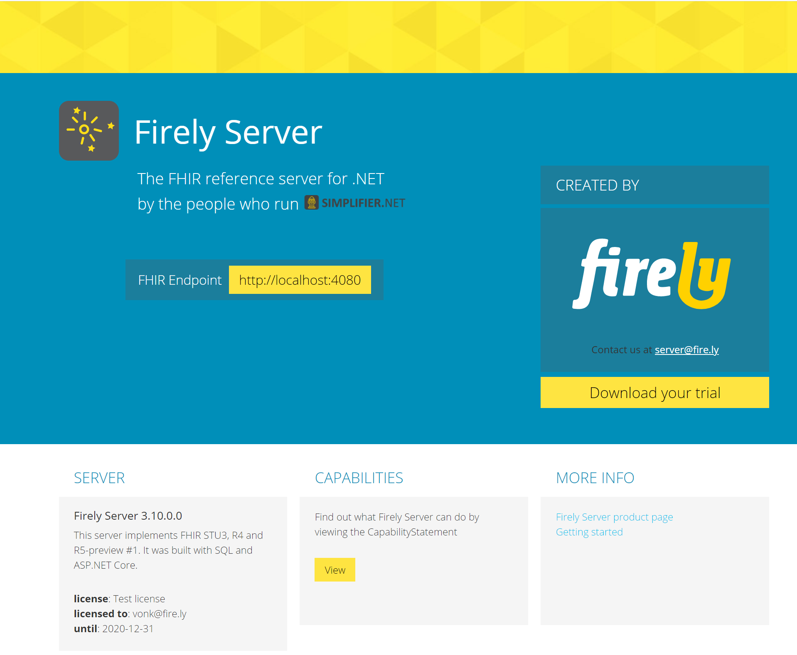

Welcome to the Firely Server's documentation!
=============================================

`Firely Server <https://fire.ly/products/vonk/>`_ is Firely's FHIR server. It was formerly named 'Vonk' and is the successor to our Spark server.

Firely Server is the answer to the growing need for a stable server that can be used in a variety of production environments.
A public sandbox is available at https://server.fire.ly, which is is free to use and intended for
testing and educational purposes only.

On these pages we provide you with the documentation you need to get up and running with your own standard Firely Server
installation, as well as information on how to contact us when you have additional needs, such as a custom implementation
or support contract.

.. toctree::
   :maxdepth: 2
   :caption: Firely Products
   :hidden:

   Back to all Firely Products <https://docs.fire.ly>

.. toctree::
   :maxdepth: 1
   :caption: Firely Server Docs:

   Overview <overview>
   Getting started <getting_started>
   Release notes <releasenotes/releasenotes>
   How to upgrade <releasenotes/upgrade>
   Roadmap <releasenotes/roadmap>
   FAQ <faq>
   Configuration <configuration/configuration>
   Deployment <deployment/deployment>
   Security <security/security>
   Performance <performance/performance>
   Features <features/features>
   Compliance & Certification <compliance/compliance>
   Administration API <administration_api>
   Plugins <plugins/plugins>
   Facade <facade/facade>
   Reference <reference/reference>
   Tools <tools/tools>
   contact
