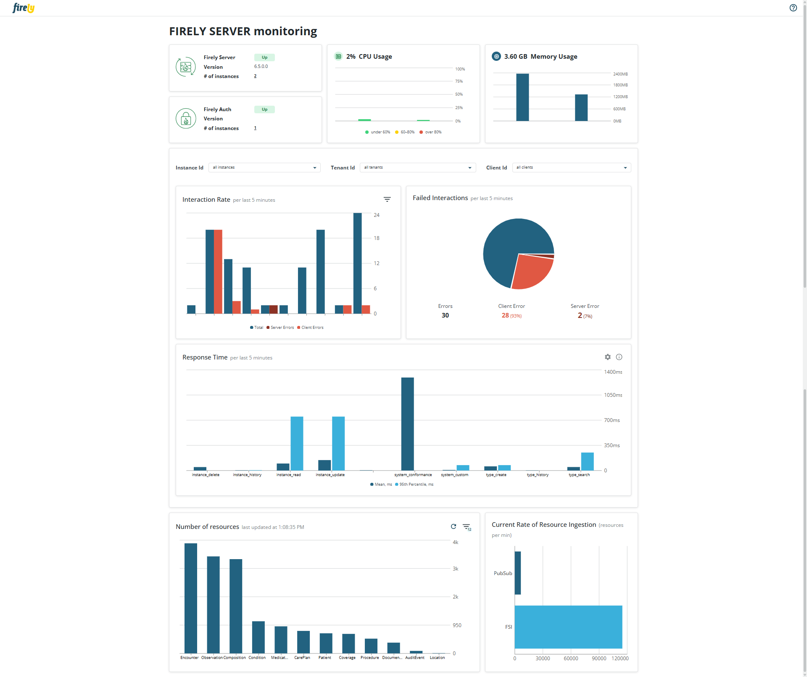

.. _feature_metrics_dashboard:

Metrics Dashboard
=================

.. note::

  The features described on this page are available in **all** :ref:`Firely Server editions <vonk_overview>`.

Firely Server offers a Metrics Dashboard that provides an out-of-the-box observability experience.
The dashboard visualizes key metrics collected via OpenTelemetry without requiring external tools or additional setup.

The dashboard is intended for:

- Quick validation that Firely Server is operating correctly.
- Immediate insights into request throughput, latencies, and error rates.
- Environments where external monitoring solutions are not yet configured.

.. note::

   The dashboard is not designed to replace production-grade monitoring
   solutions such as Grafana or Application Insights. For long-term monitoring,
   analytics, and alerting, it is recommended to export telemetry data to an
   OpenTelemetry Collector and visualize it in a dedicated monitoring stack.

.. important::

   Full support for the metrics dashboard requires Firely Server and Firely Server Ingest v6.5.0, and Firely Auth v4.5.0.

Available Metrics
-----------------

The dashboard displays a curated set of server-level and instance-level metrics relevant to FHIR workloads:

.. list-table::
   :header-rows: 1
   :widths: 25 30

   * - Category
     - Description
   * - Availability
     - Uptime and reachability of Firely Server and Firely Auth endpoints
   * - System
     - Memory footprint of each Firely Server instance
   * - System
     - CPU utilization of each Firely Server instance
   * - Workload (configurable per instance / tenant / client_id)
     - Number of FHIR interactions in the last 5 minutes
   * - Workload (configurable per instance / tenant / client_id)
     - Number of failed FHIR interactions in the last 5 minutes
   * - Workload (configurable per instance / tenant / client_id)
     - Response time of FHIR interactions in the last 5 minutes
   * - Resources
     - Number of resources stored per resource type
   * - Resources
     - Current ingestion rate via REST API, FSI, or PubSub

Installing the dashboard
------------------------
The dashboard can be downloaded either as a docker image or as a collection of binaries. Regardless of the form, the dashboard uses the following ports by default:

+-------+---------------------------------+-----------------------------------------------------------------------------+
| Port  | Service                         | Remarks                                                                     |
+=======+=================================+=============================================================================+
| 7174  | Dashboard web UI                | Open in your browser to view the Dashboard                                  |
+-------+---------------------------------+-----------------------------------------------------------------------------+
| 4317  | OpenTelemetry ingestion (GRPC)  | Include in Firely Server settings as a destination for OpenTelemetry data   |
+-------+---------------------------------+-----------------------------------------------------------------------------+

Docker
^^^^^^

1. Open your favorite command line tool and execute this command:
   ``> docker pull firely/dashboard``

2. Start the container (where FirelyServerUrl is the URL Firely Server runs on):
   - in cmd.exe: ``docker run -d -p 7174:7174 -p 4317:4317 -e FirelyServerUrl="http://host.docker.internal:4080" --name firely/dashboard``
   - in Powershell / Bash on macOS: ``docker run -d -p 7174:7174 -p 4317:4317 -e FirelyServerUrl='http://host.docker.internal:4080' --name firely/dashboard``

3. Open a browser and use the address ``http://localhost:7174/``. This will show the landing page of Firely Server Dashboard. It does not show any data yet.

Binaries
^^^^^^^^

1. Download the binaries from `Firely Downloads <https://downloads.fire.ly/>`_

2. Extract the zip into a folder on your system

3. Start the dashboard by navigating to your working folder and executing
   ``> dotnet .\FirelyServerDashboard.dll``

4. Open a browser and use the address ``http://localhost:7174/``. This will show the landing page of Firely Server Dashboard. It does not show any data yet.

Connecting Firely Server
^^^^^^^^^^^^^^^^^^^^^^^^

1. Enable metrics in the configuration. See :ref:`feature_opentelemetry` for details. The metrics dashboard ingests OTLP metrics from Firely Server, Firely Auth, and Firely Server Ingest. Each application must be configured separately.

2. Configure the OpenTelemetry endpoint to point to the Firely Server Metrics Dashboard backend on port ``4317`` and start the backend service. Alternatively, configure the OpenTelemetry Collector to forward metrics to both the dashboard and Prometheus endpoints.

3. (Re)start Firely Server.

.. note::

   Metrics become visible in the dashboard after approximately one minute.
   Metrics are cached for five minutes and discarded afterwards.

Settings
^^^^^^^^
You can change the URLs the dashboard is listening on by adding appsettings.instance.json and specifying only the settings you want to override (similar to :ref:`configure_appsettings`). If you select a https-URL, you have to provide information on the server-side certificate (similar to :ref:`configure_hosting`) you want to use to secure the connection:

.. code-block:: json

   {
     "Kestrel": {
       "Endpoints": {
         "DashboardUI": {
           "Url": "https://0.0.0.0:7174",
           "Certificate": {
             "Path": "<path to your .pfx certificate>",
             "Password": "<password of your .pfx certificate>"
           }
         },
         "OpenTelemetry": {
           "Url": "https://0.0.0.0:4317",
           "Protocols": "Http2",
           "Certificate": {
             "Path": "<path to your .pfx certificate>",
             "Password": "<password of your .pfx certificate>"
           }
         }
       }
     }
   }

.. important::

   If you choose to expose the dashboard to the internet, we urge you to use a reverse proxy with a layer of authentication enabled

Example Use Cases
-----------------

- Health check: Verify responsiveness and request handling.
- Development and testing: Monitor latency and error spikes without additional tooling.
- Resource ingestion insights: Monitor Firely Server performance and ensure data ingestion without failures.

Release Notes
-------------

.. _dashboard_releasenotes_0_1_0:

Release 0.1.0, February 18th, 2026
^^^^^^^^^^^^^^^^^^^^^^^^^^^^^^^^^^

This is a beta release of the dashboard, which is not yet intended for production use, but can be used for testing and feedback purposes. The dashboard is available as a docker image and as a collection of binaries. It supports metrics from Firely Server (v6.5.0 and up), Firely Auth (v4.5.0 and up), and Firely Server Ingest (v6.5.0 and up).