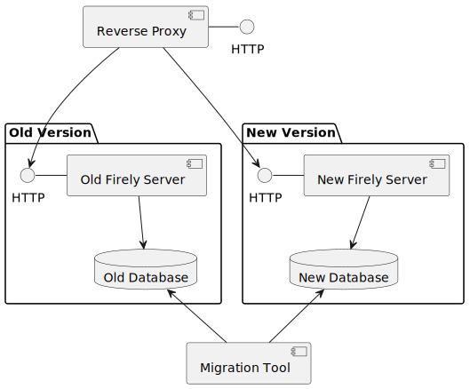

.. _zero_downtime_migration:

Zero-downtime Migration
===============================

Firely Server v6 introduces an enhanced MongoDB database migration process. In contrast to the previous migration method that required system downtime, this new approach enables zero-downtime migration. This allows for continuous operation of your existing Firely Server instance while the data migration to the new schema proceeds.

.. warning::
   Please note that any snapshot produced by the bulk data export functionality will not be available after the migration. Bulk data export data is excluded from the migration process.

Architecture Overview
---------------------

The following diagram illustrates the architecture and components involved in the migration process:

The architecture consists of:

* An existing database containing the source data
* The current Firely Server instance maintaining normal operations during migration
* A new target database instance initialized empty
* A migration tool operating asynchronously to transform and transfer data
* A new Firely Server instance configured for the target database
* A reverse proxy managing request routing between instances

.. note::
   During the migration period, both database instances operate concurrently. 
   However, the migration is one-way only, changes from the new instance are not synced back to the old instance.

Prerequisites
-------------

Before starting the migration, ensure you have:

* Firely Server Integration (FSI) tool downloaded
* Sufficient disk space for both databases during migration
* License file with the token ``http://fire.ly/vonk/plugins/bulk-data-import/migration``
* Access credentials for both source and target MongoDB instances
* `MongoDB Shell (mongosh) <https://www.mongodb.com/products/tools/shell>`_ installed for sharding configuration

.. _migration_admin_database:

Migration of Admin Database
---------------------------

.. warning::
   This zero-downtime migration process applies only to the main database, configured as described in :ref:`configure_mongodb`.

If you use MongoDB as the **admin** database, you will need to let the new FS version instance initialize its new *vonkadmin* database from scratch. You can do that by specifying a different connection string for the admin database than your previous installation.
If you previously imported custom conformance resources, make sure to include them in your new installation. 

This can be done as described in :ref:`conformance_import` or by manually creating/updating the resources via the new FS installation's ``/administration`` endpoints.

Make sure to re-create your custom :ref:`AccessPolicies <feature_accesscontrol_permissions>` and/or :ref:`Subscriptions <feature_subscription>` if you use them.

Migration of Main Database
--------------------------

1. Determine the target database deployment location and make a note of the connection string for reference in the next steps.

2. For implementations requiring sharding, execute the following configuration steps:

   - Ensure your MongoDB installation supports sharding. Refer to the MongoDB documentation if uncertain.
   - Provision the schema using the following command:

      .. code-block:: bash
         :caption: Bash

         COLLECTION_NAME=vonkentries
         CONNECTION_STRING=<YOUR_CONNECTION_STRING>
         LICENSE_FILE=<path-to-your-license-file>

         mkdir empty_dir

         dotnet fsi.dll \
         --provisionTargetDatabase true \
         --dbType MongoDb \
         --mongoConnectionstring $CONNECTION_STRING \
         --mongoCollection $COLLECTION_NAME \
         --license $LICENSE_FILE \
         --source empty_dir

         rm -rf empty_dir

   - Configure sharding for the entries collection using the command below:

      .. code-block:: bash

         DB_NAME=vonkdata
         COLLECTION_NAME=vonkentries
         CONNECTION_STRING=<YOUR_CONNECTION_STRING>

         mongosh $CONNECTION_STRING <<EOF
         sh.shardCollection("$DB_NAME.$COLLECTION_NAME", { type: 1, im: 1, cur: 1, cnt: 1, change: 1, res_id: "hashed" });
         EOF

3. Execute the FSI migration process:
  
   Initialize the migration by executing the following command:

   .. code-block:: bash

        RECOVERY_JOURNAL_DIRECTORY=./journal # A directory where the progress will be stored in case of a crash. FSI will quickly catch up to the place where an error occurred.
        FHIR_VERSION=R4

        LICENSE_FILE="<path to your license file>"

        RUNNING_MODE=Continuous # Or AdHoc. If AdHoc mode is used, FSI will terminate when all the items from the old DB have been processed.

        SOURCE_CONNECTION_STRING="<old db connection string>"
        SOURCE_COLLECTION_NAME=vonkentries

        CONNECTION_STRING="<new DB connection string>"
        COLLECTION_NAME=vonkentries

        dotnet fsi.dll \
            --fhir-version $FHIR_VERSION \
            --provisionTargetDatabase true \
            --useRecoveryJournal $RECOVERY_JOURNAL_DIRECTORY \
            --sourceType MongoDb \
            --srcMongoCollection $SOURCE_COLLECTION_NAME \
            --srcMongoConnectionString $SOURCE_CONNECTION_STRING \
            --srcMongoRunningMode $RUNNING_MODE \
            --update-existing-resources ErrorOnConflict \
            --dbType MongoDb \
            --mongoConnectionstring $CONNECTION_STRING \
            --mongoCollection $COLLECTION_NAME \
            --license $LICENSE_FILE

   Migration completion is indicated by the following message: ``No new items found in the database. Waiting for 00:00:05 before retrying...``

4. Provision an instance of the new version of Firely Server
5. Verify that the migration was successful by inspecting the data in the target database, see the :ref:`verification steps <migration_admin_database_verification>` below
5. Update the reverse proxy configuration to direct traffic to the new Firely Server instance
6. Decommission the instance(s) of the old version of Firely Server
6. Terminate the FSI migration tool

.. _migration_admin_database_verification:

Verification Steps
------------------

After migration completion:

1. Compare record counts between source and target databases:

   .. code-block:: bash

      SOURCE_CONNECTION_STRING="<old db connection string>"
      CONNECTION_STRING="<new DB connection string>"

      # For source database
      mongosh $SOURCE_CONNECTION_STRING --eval "db.vonkentries.count()"
      
      # For target database
      mongosh $CONNECTION_STRING --eval "db.vonkentries.count()"

2. Verify data integrity by sampling records
3. Try a few Search requests on the new Firely Server instance

Rollback Plan
-------------

In case of migration issues:

1. Keep the original database and Firely Server instance running
2. Stop the FSI migration process
3. Review logs and correct any issues before retrying
4. If you choose to remove data from the target database and start from scratch, make sure to also remove the journal directory

Performance Optimization
------------------------

**Network Considerations**
- Use the same data center for the source and target databases and the machine that runs FSI to ensure high network throughput.