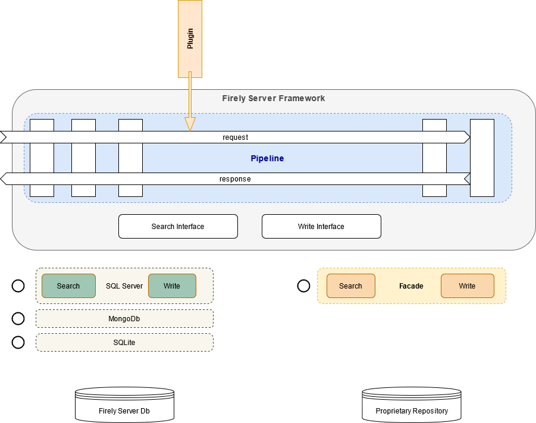

.. _vonk_overview:

Overview of Firely Server, Plugins and Facades
=================================================

Framework
---------

Firely Server is not just a FHIR Server, it is a processing pipeline for handling standard and custom FHIR requests. :ref:`Firely Server <vonk_overview_server>` consists of this pipeline filled with processors to handle the interactions defined in the FHIR RESTful API. With :ref:`vonk_overview_plugins` you can add your own processors to the framework to perform custom operations, or fill in cross-cutting concerns for your business. A :ref:`Facade <vonk_overview_facades>` is a type of plugin that provides a data access layer for an existing data repository (e.g. a proprietary system). This image sums it all up:

Firely Server comes in several editions:

* Sandbox: try it right now on https://server.fire.ly
* Evaluation: get an evaluation license from `Simplifier.net <https://simplifier.net/firely-server>`_, allowing you to explore all functionality for free during a week (renewable)
* Community: use Firely Server for free, but only on SQLite
* Commercial use with professional support in different tiers: Startup or Scale

.. TODO: license link to Simplifier for Community 

For more information and pricing visit the `product site <https://fire.ly/products/firely-server/>`_.

.. _vonk_overview_server:

Complete Server
---------------

Firely Server is a FHIR Server out of the box. It is built with Microsoft .NET Core and runs on any of the platforms for which a `.NET Core Runtime <https://dotnet.microsoft.com/download>`_ is available. Linux, Windows, MacOS, Docker etcetera. Installation can be done in minutes. After that you can configure main features and further details:

* Choose your :ref:`database <configure_repository>`: :ref:`SQLite <configure_sqlite>` is configured by default, but for serious use you'd want to configure :ref:`MongoDB <configure_mongodb>` or :ref:`SQL Server <configure_sql>`.
* Configure the level of :ref:`validation <feature_prevalidation>`: Firely Server can be very loose or very strict on the validity of the resources that you send to it.
* Configure :ref:`endpoints <feature_multiversion_endpoints>` for FHIR versions that you want to support (since Firely Server (Vonk) 3.0.0: FHIR STU3 and FHIR R4)
* Fill in your :ref:`licensefile <configure_license>`.
* Adjust the :ref:`processing <settings_pipeline>` pipeline by trimming it down (excluding certain plugins) or extending it with extra plugins.

Besides configuration of the settings, Firely Server features an :ref:`Administration API <administration_api>` that allows you to configure the so-called :ref:`Conformance Resources <conformance>` that drive parsing, serialization, validation and terminology. The Administration API is pre-filled with Conformance Resources such as the StructureDefinitions, Searchparameters, CodeSystems and ValueSets that come with the FHIR Specification. Beyond that you can use the Administration API to make Firely Server aware of:

* Custom profiles, e.g. national or institutional restrictions on the standard FHIR resources.
* :ref:`Custom resources <feature_customresources>`: you can even define resources beyond those in FHIR and they are treated as if they were standard FHIR resources.
* CodeSystem and ValueSet resources for :ref:`terminology <feature_terminology>`.
* :ref:`Custom Searchparameters <feature_customsp>`: have Firely Server index and search resources on properties that are not searchable with the searchparameters from the FHIR Specification itself.

Read more on Firely Server:

* :ref:`vonk_getting_started`
* :ref:`vonk_features`
* :ref:`deployment`
* :ref:`configure_vonk`
* :ref:`vonk_releasenotes`
* :ref:`administration_api`

.. _vonk_overview_plugins:

Plugins
-------

A plugin is a library of code that you can buy, clone or create yourself that implements additional or replacement functionality in Firely Server. Examples are:

* Implementation of a custom operation. E.g. $document (generate a document Bundle based on a Composition resource), which is available on GitHub. Or $transform (execute a FHIR Mapping on a source structure to produce a target structure), which is developed by Healex and can be bought separately.
* Implementation of a cross-cutting concern. Imagine that in your organization every resource that is created or updated must be logged to a very specific location. You may create a plugin that does exactly that.
* Special handling of specific requests. E.g. requests for a Binary resource where you need to merge in binary data from one of your systems.
* Provide custom authentication and authorization methods for compliancy with business or governmental rules.

In all cases, a Plugin is technically a .NET Core assembly (or a set of them) containing well-defined configuration methods that allow Firely Server to:

* add services
* add a processor to the request processing pipeline

Most plugins do both, registering (testable) services that do the actual work and a thin layer around it that adds it as a processor to the pipeline.

Read more on :ref:`vonk_plugins`.

View the `session on Plugins <https://www.youtube.com/watch?v=odYaOM19XXc>`_ from `DevDays 2018 <https://www.devdays.com/events/devdays-europe-2018/>`_.

.. _vonk_overview_facades:

Facades
-------

A Facade is a Firely Server processing pipeline working on an existing data repository. That repository could be the database of proprietary system, some API of an existing system or a whole Clinical Data Repository specifically created to open up data through a FHIR API.

The implementation of a Facade is a special type of plugin that registers services to access the existing data repository. By building the data access layer you leverage all of the FHIR processing in Firely Server, connected to your repository - thus creating a FHIR RESTful API for that repository with the least amount of work.

So a Facade is still a Plugin, and therefore technically a .NET Core assembly (or a set of them) having the same well-defined configuration methods. In the case of a Facade it usually only registers services (and no processor), specifically implementing the interfaces that define the data access layer in Firely Server:

* ISearchRepository, for reading and searching
* IResourceChangeRepository: for creating, updating, and deleting

Read more on :ref:`vonk_facade`.

View the `session on Facade <https://www.youtube.com/watch?v=6SFd1QJJXtA>`_ from `DevDays 2018 <https://www.devdays.com/events/devdays-europe-2018/>`_.
