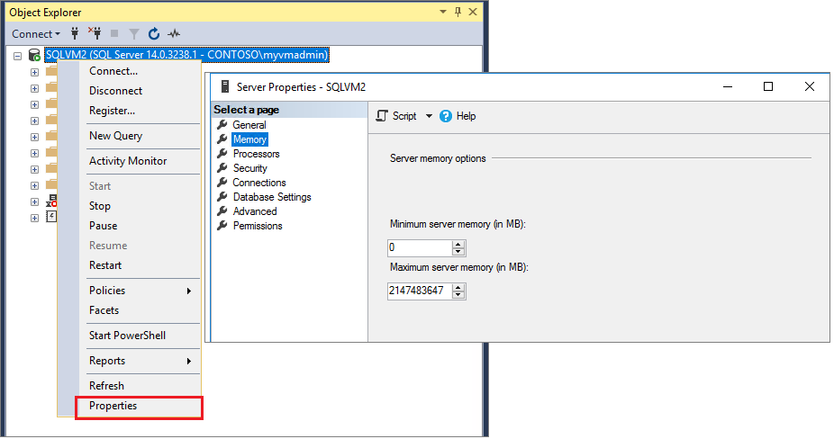

Memory Settings
===============

The total ammoun of memory needed by SQL Server depends on your use case and (expected) workload. SQL Server will claim memory from the OS when needed but will not give it back to the OS once claimed. When not specifying a limit you will run the risk of starving the host server and OS of enough free memory to operate efficently. It is therefore strongly advised to limit the maximum ammount SQL Server will use.

To set a fixed amount of memory using SSMS [#]_:

#. In Object Explorer, right-click a server and select Properties.
#. Click the Memory node.
#. Under Server Memory Options, enter the amount that you want for Minimum server memory and Maximum server memory.

Use the default settings to allow SQL Server to change its memory requirements dynamically based on available system resources. It is recommended to set a max server memory as detailed above.

As for the ammount of memory to reserve for the OS, Windows Server with Desktop Experience requires a minimum of 2 GB [#]_, but more is better so aim for at least 4 GB. For example if your server has 64GB of memory, set the amount of memory in SQL Server to be 60,000MB (i.e. 64GB - 4GB = 60GB)

.. [#] `Server memory configuration options <https://docs.microsoft.com/en-us/sql/database-engine/configure-windows/server-memory-server-configuration-options?view=sql-server-ver15#procedure-for-configuring-a-fixed-amount-of-memory-not-recommended>`_
.. [#] `Memory requirements for Windows Server <https://docs.microsoft.com/en-us/windows-server/get-started/hardware-requirements#ram>`_