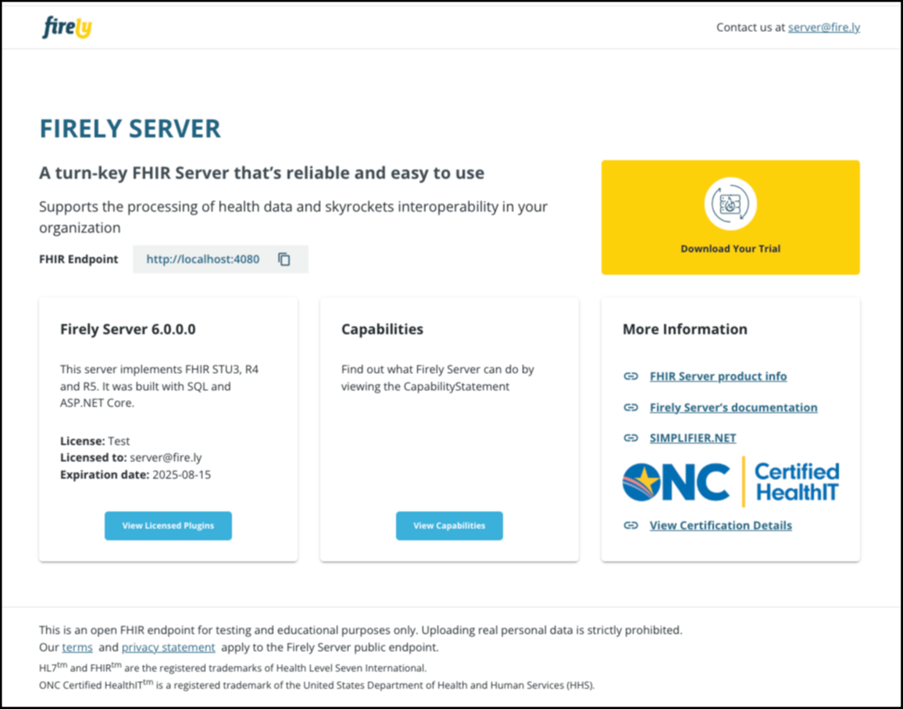

.. _vonk_plugins_landingpage:

Firely Server Plugin example - Create a new landing page
========================================================

As a minimal example of how to use Firely Server Plugins we will show you how to create a library with your own landing page, and use it to replace the landing page that is provided by Firely Server.
The landing page is the webpage you see when you access Firely Server's endpoint with a browser. By default it looks like this:

Create a new ASP.NET Core web application
-----------------------------------------

In Visual Studio create a new project of type ASP .NET Core Web Application:

Press OK to continue.

Choose a name for your project and solution. Click Create to continue. 

Choose ASP.NET Core 3.1 and select Web Application (Model-View-Controller). Press OK.

Add Firely Server Package
-------------------------

Add Vonk.Core via the Nuget Package Manager:

This will give you access to all the core components of Firely Server, including the ``Vonk.Core.Pluggability.VonkConfiguration`` attribute.

Adjust project file
-------------------

Add wwwroot and Views as an Embedded resource in the project file (that is neccessary for Firely Server to pick them up from a library dll). 
To edit the project file, right click on the project file and select Edit <projectname>.cproj:

.. code-block:: xml

   <ItemGroup>
      <EmbeddedResource Include="wwwroot\**\*" />
      <EmbeddedResource Include="Views\**" />
   </ItemGroup>

The project file will look like this:

.. code-block:: xml

   <Project Sdk="Microsoft.NET.Sdk.Web">

      <PropertyGroup>
         <TargetFramework>netcoreapp3.1</TargetFramework>
      </PropertyGroup>

      <ItemGroup>
         <PackageReference Include="Vonk.Core" Version="3.4.0" />
      </ItemGroup>
      
      <ItemGroup>
         <EmbeddedResource Include="wwwroot\**\*" />
         <EmbeddedResource Include="Views\**" />
      </ItemGroup>

   </Project>

Save the project file.

Create the configuration class
------------------------------

Next, add a new file for the configuration class, as described in :ref:`vonk_plugins_configclass`. Annotate it with ``[VonkConfiguration(order: 802)]``. In the example below the class is named UIConfiguration.
Then add the static methods as prescribed: 

.. code-block:: csharp

   public static IServiceCollection AddUIServices(IServiceCollection services)
   {
      var thisAssembly = typeof(UIConfiguration).GetTypeInfo().Assembly;
      services
         .AddMvc(option => option.EnableEndpointRouting = false)
         .AddRazorRuntimeCompilation()
         .AddApplicationPart(thisAssembly)
         .AddControllersAsServices();

      var embeddedFileProvider = new EmbeddedFileProvider(
         thisAssembly,
         thisAssembly.GetName().Name
      );

      services.Configure<MvcRazorRuntimeCompilationOptions>(options =>
      {
         options.FileProviders.Clear();
         options.FileProviders.Add(embeddedFileProvider);
      });
      return services;
   }

.. code-block:: csharp

   public static IApplicationBuilder UseUI(IApplicationBuilder app)
   {
      var thisAssembly = typeof(UIConfiguration).GetTypeInfo().Assembly;
      var embeddedStaticFileProvider = new EmbeddedFileProvider(
         thisAssembly,
         thisAssembly.GetName().Name + ".wwwroot"
      );

      app.UseStaticFiles(new StaticFileOptions() { FileProvider = embeddedStaticFileProvider });

      return app.MapWhen(ctx => ctx.IsBrowserRequest(), ab => ab.UseMvcWithDefaultRoute());
   }

The source file will then look like this:

Deploy and Configure
--------------------

Build this project in Release mode and copy the produced dll (located in <src>\\bin\\Release\\netcoreapp3.1) to the plugin directory of Firely Server, as configured in the :ref:`PipelineOptions:PluginDirectory<vonk_plugins_config>`.

Go to the :ref:`configure_appsettings` of Firely Server, and replace the namespace of the landingpage (``Vonk.UI.Demo``) in the include of the PipelineOptions:

.. code-block:: JavaScript

   "PipelineOptions": {
      "PluginDirectory": "./plugins",
      "Branches": [
         {
            "Path": "/",
            "Include": [
               "Vonk.Core",
               "Vonk.Fhir.R3",
               "Vonk.Fhir.R4",
               //"Vonk.Fhir.R5"
               "Vonk.Repository.SqlVonkConfiguration",
               "Vonk.Repository.SqliteVonkConfiguration",
               "Vonk.Repository.MongoDbVonkConfiguration",
               "Vonk.Repository.MemoryVonkConfiguration",
               "Vonk.Subscriptions",
               "Vonk.Smart",
               "WebApplication2" //This is the adjustment you make.
               "Vonk.Plugin.DocumentOperation.DocumentOperationConfiguration",
               "Vonk.Plugin.ConvertOperation.ConvertOperationConfiguration",
               "Vonk.Plugin.BinaryWrapper",
               "Vonk.Plugin.MappingToStructureMap.MappingToStructureMapConfiguration",
               "Vonk.Plugin.TransformOperation.TransformOperationConfiguration",    
               "Vonk.Plugin.Audit"
            ],
            "Exclude": [
               "Vonk.Subscriptions.Administration"
            ]
         },
         {
            "Path": "/administration",
            "Include": [
               "Vonk.Fhir.R3",
               "Vonk.Fhir.R4",
               //"Vonk.Fhir.R5"
               "Vonk.Repository.SqlAdministrationVonkConfiguration",
               "Vonk.Repository.SqliteAdministrationVonkConfiguration",
               "Vonk.Repository.MongoDbAdministrationVonkConfiguration",
               "Vonk.Repository.MemoryAdministrationVonkConfiguration",
               "Vonk.Subscriptions.Administration",
               "Vonk.Plugins.Terminology",
               "Vonk.Plugin.Audit",
               "Vonk.Administration"
            ],
            "Exclude": [
               "Vonk.Core.Operations",
               "Vonk.Core.Licensing.LicenseRequestJobConfiguration"
            ]
         }
      ]
   }

Run and admire
--------------

Now run Firely Server from the commandline or Powershell window with 

:: 

   	> dotnet .\Vonk.Server.dll

Open a browser and visit the homepage of Firely Server (http://localhost:4080) to admire your own landingpage.

