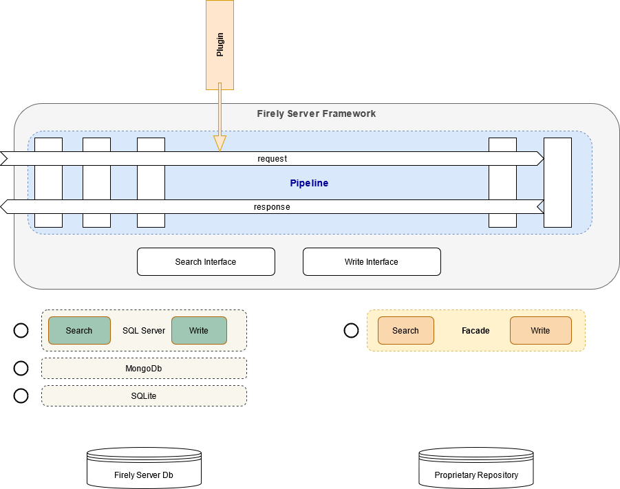

.. _architecture:

============
Architecture
============

.. _vonk_overview_server:

Framework
---------

Firely Server is not just a FHIR Server, it is a processing pipeline for handling standard and custom FHIR requests. :ref:`Firely Server <vonk_overview_server>` consists of this pipeline filled with processors to handle the interactions defined in the FHIR RESTful API. With :ref:`vonk_overview_plugins` you can add your own processors to the framework to perform custom operations, or fill in cross-cutting concerns for your business. A :ref:`Facade <vonk_overview_facades>` is a type of plugin that provides a data access layer for an existing data repository (e.g. a proprietary system). This image sums it all up:

Pipeline and middleware components
----------------------------------

Firely Server is built upon ASP.NET Core and its modular setup of a pipeline of middleware_.
It also leverages the `dependency injection`_ pattern that is central to ASP.NET Core.
If you are not familiar with these concepts, please review them first.

Firely Server's core plugins provide middleware components that handles the interactions of the `FHIR RESTful API`_. These components are placed in the pipeline. 
The pipeline starts with a few general components that interpret the incoming http request and determine which interaction is being called. 
This information is fed to the rest of the pipeline as the Request property of an IVonkContext object, analogous to the HttpContext and its Request property of ASP.NET Core itself.
The IVonkContext also provides the Response property that is used to communicate the status, resource and/or OperationOutcome resulting from the interaction.
On the way back through the pipeline the counterparts of the interpreting middleware translate the IVonkContext Response back to an http response, conforming to the FHIR specification.
The rest of the pipeline consists of middleware components that each fulfill one of the interactions. So there is one for ``read``, one for ``create``, for ``search`` et cetera. 
These components are just regular ASP.Net Core Middleware components, except that they have access to the IVonkContext, and act on that. 

Adding custom middleware
^^^^^^^^^^^^^^^^^^^^^^^^

Using Firely Server Components you can add your own middleware anywhere in the pipeline. It can be standard ASP.NET Core middleware - having nothing to do with FHIR - or middleware acting on the IVonkContext,
e.g. to implement a custom operation. Firely Server also provides convenience methods to register your middleware as one that handles a FHIR interaction, 
including attributes to declare for which interaction and which resource types your middleware should be invoked. 
This is explained in :ref:`vonk_plugins`.

.. _vonk_overview_plugins:

Plugins
-------

A plugin is a library of code that you can buy, clone or create yourself that implements additional or replacement functionality in Firely Server. Examples are:

* Implementation of a custom operation. E.g. $document (generate a document Bundle based on a Composition resource), which is available on `GitHub <https://github.com/FirelyTeam/Vonk.Plugin.DocumentOperation>`_.
* Implementation of a cross-cutting concern. Imagine that in your organization every resource that is created or updated must be logged to a very specific location. You may create a plugin that does exactly that.
* Special handling of specific requests. E.g. requests for a Binary resource where you need to merge in binary data from one of your systems.
* Provide custom authentication and authorization methods for compliancy with business or governmental rules.

In all cases, a Plugin is technically a .NET Core assembly (or a set of them) containing well-defined configuration methods that allow Firely Server to:

* add services
* add a processor to the request processing pipeline

Most plugins do both, registering (testable) services that do the actual work and a thin layer around it that adds it as a processor to the pipeline.

Read more on :ref:`vonk_plugins`.

View the `session on Plugins <https://www.youtube.com/watch?v=odYaOM19XXc>`_ from `DevDays 2018 <https://www.devdays.com/events/devdays-europe-2018/>`_.

.. _vonk_overview_facades:

Facades
-------

A Facade is a Firely Server processing pipeline working on an existing data repository. That repository could be the database of proprietary system, some API of an existing system or a whole Clinical Data Repository specifically created to open up data through a FHIR API.

The implementation of a Facade is a special type of plugin that registers services to access the existing data repository. By building the data access layer you leverage all of the FHIR processing in Firely Server, connected to your repository - thus creating a FHIR RESTful API for that repository with the least amount of work.

So a Facade is still a Plugin, and therefore technically a .NET Core assembly (or a set of them) having the same well-defined configuration methods. In the case of a Facade it usually only registers services (and no processor), specifically implementing the interfaces that define the data access layer in Firely Server:

* ISearchRepository, for reading and searching
* IResourceChangeRepository: for creating, updating, and deleting

Read more on :ref:`vonk_facade`.

View the `session on Facade <https://www.youtube.com/watch?v=6SFd1QJJXtA>`_ from `DevDays 2018 <https://www.devdays.com/events/devdays-europe-2018/>`_.

Repository interfaces
---------------------

Many of the FHIR interactions require access to a repository of resources. E.g. ``create`` must be able to store a resource, whereas ``search`` must be able to query resources and retrieve the results.
In Firely Server, the middleware components that implement these interactions access the repository through interfaces. There are two different interfaces for different parts of the `FHIR RESTful API`_.

.. code-block:: csharp 

    IChangeRepository           //for create, update and delete
    ISearchRepository           //for all types of search, read and history

In many scenarios, read-only access is sufficient, and you only need to implement the ISearchRepository.
In that implementation you can choose which of the search parameters you want to support, and whether to expose versions and deleted resources.

These interfaces enable you to implement a Firely Server Facade. And they enable us to support database engines as diverse as MongoDB, SQL Server and in-memory.

Search
^^^^^^

The `FHIR RESTful Search`_ is the most complex part of the `FHIR RESTful API`_. Firely Server is capable of interpreting the search and translating it to small query-bits irrespective of the actual repository implementation.
When implementing the ``ISearchRepository`` you get full control over which parameters you support and how you support them. 
On the method ``ISearchRepository.Search()``, you just get the list of arguments that make up the search, as an ``IArgumentCollection``. If you decide to act on these raw arguments directly, you can.
But if you want Firely Server to interpret the search, you can use the ``QueryBuilderContext.CreateQuery`` method that will decompose the IArgumentCollection, interpret and validate every argument in it and then call into the 
``IRepoQueryFactory.Filter`` or ``IRepoQueryFactory.ResultShape`` method for each of the arguments.

So the ``Filter`` method is called with interpreted search arguments. E.g. ``identifier=abc`` will be provided as (in pseudocode) ``Filter("identifier", TokenValue{code = "abc", noSystem = true})``.
If no search parameter is defined for an argument, you still get the chance to handle it. E.g. ``myspecialparameter=qyz`` will be provided as ``Filter("myspecialparameter", RawValue{ value = "qyz" })``. 
This allows for easy extensibility without defining your own SearchParameter resources, and is suitable for adding parameters that map to non-FHIR structures in your backend system.
Note however that Firely Server also supports :ref:`feature_customsp`.

The ``ResultShape`` method is called when an argument is recognized as a '`Search result parameter`_', like _sort or _include.

.. _vonk_architecture_capabilities:

Capabilities
------------

A FHIR server has to express its capabilities in a CapabilityStatement, available on the ``/metadata`` endpoint. Firely Server's capabilities are defined by the middleware components that make up its pipeline. 
Every component knows what interaction it adds to the capabilities. Therefore, we keep that information close to the component itself. 
Typically, every component has an implementation of :code:`ICapabilityStatementContributor`, in which it gets access to the :code:`ICapabilityStatementBuilder`. 
The latter provides methods to add information to the CapabilityStatement without having to worry about what is already added by other components or the order of execution.

These methods are especially handy for implementers of a `facade <facade/facade>`_. Plugins implemented in the facade do not automatically end up in the ``/metadata`` endpoint of Firely Server, but :code:`ICapabilityStatementContributor` and :code:`ICapabilityStatementBuilder` can be used to make sure the plugins are visible in the CapabilityStatement.
For example, you have implemented a Bulk Data Export plugin in your facade and you would like to make sure this is visible in the CapabilityStatement.instantiates of Firely Server.
You can add a CapabilityStatementContributor class to your plugin code that implements the :code:`ICapabilityStatementContributor`. 
Within this class you can implement the :code:`ICapabilityStatementBuilder` to add your plugin to the CapabilityStatement.instantiates. 
See the following code snippet::

    internal class CapabilityStatementContributor: ICapabilityStatementContributor
    {
        public void ContributeToCapabilityStatement(ICapabilityStatementBuilder builder)
        {
            builder.UseCapabilityStatementEditor(cse =>
            {
                cse.AddInstantiates("http://hl7.org/fhir/uv/bulkdata/CapabilityStatement/bulk-data");
            });
            }
        }

Make sure to register this class in your PluginConfiguration.cs::

    public static IServiceCollection ConfigureServices(IServiceCollection services)
        {
            services.TryAddContextAware<ICapabilityStatementContributor, CapabilityStatementContributor>(ServiceLifetime.Transient);
            return services;
        }
        
.. _middleware: https://docs.microsoft.com/en-us/aspnet/core/fundamentals/middleware
.. _dependency injection: https://docs.microsoft.com/en-us/aspnet/core/fundamentals/dependency-injection
.. _FHIR RESTful API: http://www.hl7.org/implement/standards/fhir/http.html
.. _FHIR RESTful Search: http://www.hl7.org/implement/standards/fhir/search.html
.. _Search result parameter: http://www.hl7.org/implement/standards/fhir/search.html#2.21.1.1
