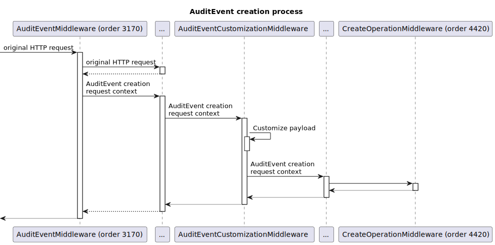

.. _feature_auditing:

Auditing
========

Firely Server can log access through the RESTful API for auditing purposes. It has three main features:

#. Write requests and responses to a separate audit logfile.
#. Include user id and name from the JWT token (if present) in the audit log lines.
#. Write the audit information as FHIR AuditEvent resources in the Firely Server Data database.

These features can be enabled by including ``Vonk.Plugins.Audit`` in the pipeline.

.. code-block:: JavaScript

   "PipelineOptions": {
      "PluginDirectory": "./plugins",
      "Branches": [
         {
            "Path": "/",
            "Include": [
               "Vonk.Core",
               ...
               "Vonk.Plugin.Audit"
            ],
            ...
         },
         ...
      ]
   }

See :ref:`vonk_plugins_config` for more details on pipeline configuration.

At present, you can choose either to enable both file and database logging, or only database logging.
To enable only database logging, replace Vonk.Plugin.Audit with Vonk.Plugin.Audit.AuditEventConfiguration.
In addition, you can choose to log every call or only transaction batches.
When you include a specific configuration class and want to enable username logging, you have to include Vonk.Plugin.Audit.UsernameLoggingConfiguration.
Please see :ref:`vonk_plugins_audit` for the available options.

Filtering configuration
-----------------------

You can exclude requests from generating audit logs (both audit log file and audit event logging). 
This is helpful to reduce clutter in the logs. For example, you could exclude logging for an endpoint that is used for health monitoring of the server.
The example below disables audit logging for all GET requests to /Patient and sub resources or operations.

.. code-block:: JavaScript

   "Audit": {
      "ExcludedRequests": [
         {
            "UrlPath": "/Patient",
            "Method": "GET"
         },
         {
            "UrlPath": "/Patient/*",
            "Method": "GET"
         }
      ]
   },

The UrlPath property is required, but not otherwise checked (e.g. if it points to an existing resource).
The wildcard (\*) can be used to expand matching in different ways, e.g.:

* /Medication* will match /Medication, /MedicationRequest, /MedicationAdministration, etc
* /$\* will match all system level operations
* /\*/\*/$validate will match all validation operations on all resources

The Method property is optional. If left out, null, empty or given the value \*, it will match all HTTP verbs. 
You can enter multiple verbs, delimited by the \| symbol (e.g. GET\|POST).

.. _configure_audit_log_file:

Audit log file configuration
----------------------------

File
^^^^

Configure where to put the audit log file and the format of its lines in a separate file named audit.logsettings.json. Just like the Firely Server application logging, the audit log also uses Serilog for logging audit events. The audit log settings are controlled in json configuration files called ``audit.logsettings(.*).json``. The files are read in a hierarchy, exactly like the :ref:`appsettings files <configure_levels>` are.
Firely Server comes with default settings in ``audit.logsettings.default.json``. You can adjust the way Firely Server logs its information by overriding these settings by either adding an additional file called ``audit.logsettings.json`` or ``audit.logsettings.instance.json``, or in ``audit.logsettings.default.json`` directly. Alternatively you can control :ref:`configure_envvar_audit_log`.

.. code-block:: JavaScript

   {
      "AuditLog": {
         "WriteTo": [
            {
               "Name": "Async",
               "Args": {
                  "configure": [
                     {
                        "Name": "File",
                        "Args": {
                           "path": "./audit/AuditLog.log",
                           "rollingInterval": "Day",
                           "fileSizeLimitBytes": "",
                           "outputTemplate": "{Timestamp:yyyy-MM-dd HH:mm:ss.fff zzz} [{Application}] [Audit] {RequestResponse} [Machine: {MachineName}] [ReqId: {RequestId}] [IP-Address: {Ip}] [Connection: {ConnectionId}] [UserId: {UserId}] [Username: {Username}] [Path: {Path}] [Parameters: {Parameters}] [Action: {Action}] [Resource: {Resource} Key:{ResourceKey}] [Search results: {SearchResultSummary}] [StatusCode: {StatusCode}] {NewLine}"
                        }
                     }
                  ]
               }
            }
         ]
      }
   }

The values that you can set for the File sink Args are:

* ``path``: The location where the audit log file should be stored.
* ``rollingInterval``: When this interval expires, the log system will start a new file. The start datetime of each interval is added to the filename. Valid values are ``Infinite``, ``Year``, ``Month``, ``Day``, ``Hour``, ``Minute``. 
* ``fileSizeLimitBytes``: Limit the size of the log file, which is 1GB by default. When it is full, the log system will start a new file.

The OutputTemplate listed here contains all the properties that can be logged:

* ``Timestamp:yyyy-MM-dd HH:mm:ss.fff zzz``: When this was logged, with formatting.
* ``Application``: Firely Server
* ``RequestResponse``: indicates wether the audit event was a request or a response.
* ``MachineName``: Name of the machine hosting the Firely Server instance. Especially useful when running multiple instances all logging to the same file.
* ``RequestId``: Unique id of this request, use this to correlate request and response.
* ``Ip``: IP Address of the client.
* ``ConnectionId``: Use this to correlate requests from the same client.
* ``UserId``: User id from the JWT token (if present).
* ``Username``: User name from the JWT token (if present).
* ``Path``: Request url.
* ``Parameters``: The request parameters used.
* ``Action``: Interaction that was requested (like instance_read or type_search).
* ``Resource``: Resourcetype involved.
* ``ResourceKey``: 'Key' of the resource involved (if any), consisting of the resourcetype and the id, formatted as "resourcetype/id".
* ``StatusCode``: Statuscode of the response at the time of logging (by default '-1' when the request is not handled yet).

For transactions and batches, the audit plugin will write a line for the transaction/batch as a whole *and* one for every entry in the transaction/batch.

Seq
^^^

Because we use Serilog for logging audit events, other Log sinks like `Seq` are also supported. `Seq <https://datalust.co/seq>`_ is a web interface to easily inspect structured logs.

For the ``Seq`` sink, you can also specify arguments. One of them is the server URL for your
Seq server::

		"WriteTo": [
			{
				"Name": "Seq",
				"Args": { "serverUrl": "http://localhost:5341" }
			}

* Change ``serverUrl`` to the URL of your Seq server

Audit Log reliability and performance considerations
^^^^^^^^^^^^^^^^^^^^^^^^^^^^^^^^^^^^^^^^^^^^^^^^^^^^

The default Serilog log sink in ``audit.logsettings.default.json`` is a asynchronous wrapper around a File sink, which means that audit log messages are pushed to a background worker thread to be written to the log file on disk. This improves application performance as the writing to the audit log is non-blocking. The async wrapper uses a buffer to collect the messages that need to be logged. For the current Serilog Async implementation, the default memory buffer feeding the worker thread is capped to 10,000 items. If this limit is reached any further log events will be dropped until the buffer is below this limit again. To change the limit you can add ``bufferSize`` to the audit logsettings. See `Serilog.Sinks.Async <https://github.com/serilog/serilog-sinks-async>`_ for more details.

In normal circumstances the buffer will regularly be flushed to the underlying sink. However, when the buffer limit does get reached the reliability of writing messages is compromised and some messages will get lost while the async wrapper tries to recover. If reliability of the auditing is very important, you might want to consider using a synchronous file sink instead. See the ``audit.logsettings.default.json`` for an example of a synchronous File sink configuration.

.. code-block:: JavaScript

   {
      "AuditLog": {
         "WriteTo": [
            {
               "Name": "File", 
               "Args": {
                  "path": "./audit/AuditLog.log",
                  "rollingInterval": "Day",
                  "fileSizeLimitBytes": "",
                  "outputTemplate": "{Timestamp:yyyy-MM-dd HH:mm:ss.fff zzz} [{Application}] [Audit] {RequestResponse} [Machine: {MachineName}] [ReqId: {RequestId}] [IP-Address: {Ip}] [Connection: {ConnectionId}] [UserId: {UserId}] [Username: {Username}] [Path: {Path}] [Parameters: {Parameters}] [Action: {Action}] [Resource: {Resource} Key:{ResourceKey}] [Search results: {SearchResultSummary}] [StatusCode: {StatusCode}] {NewLine}"
               }
            }
         ]
      }
   }

The downside is that writing to the audit log is blocking and Firely Server now has to wait on the log to finish before it can continue, which in turn affects performance. You will have to try and test what works best for your use case.

.. _audit_event_logging:

AuditEvent logging
------------------

There is no further configuration for AuditEvent logging. If you include it in the pipeline, it will start generating AuditEvent resources, conforming to the IHE `Basic Audit Log Patterns (BALP)`_ ImplementationGuide.

.. note::

   AuditEvents will not get generated if your configuration restricts the list of supported FHIR resources and ``AuditEvent`` is not included (see :ref:`supportedmodel`).

For transactions and batches the audit plugin will create an AuditEvent for the transaction/batch as a whole *and* one for every entry in the transaction/batch.

Firely Server does not allow you to update or delete the AuditEvent resources through the RESTful API so the Audit log cannot be tampered with. You can of course still manipulate these resources directly on the database, for instance to offload a surplus of old AuditEvent resources elsewhere. Please :ref:`vonk-contact` us for details if you want to do this.

The table below contains some elements you can find in the generated AuditEvents and the paths where those elements are located (might differ per FHIR version). The table also includes links to AuditEvent examples.

.. note::

  When the order of an item in an array is shown using a colon syntax (e.g. ``:requestId``, ``:query``), that means the order is not deterministic. You need to examine each item's ``type`` and/or ``role`` elements to identify the right item.

+-----------------------------+---------------------------------------------------------------------------------------+---------------------------------------------------------------------------------------+---------------------------------------------------------------------------------------+
| Property name               | AuditEvent (R3)                                                                       | AuditEvent (R4)                                                                       | AuditEvent (R5)                                                                       |
+=============================+=======================================================================================+=======================================================================================+=======================================================================================+
| MachineName                 | ``source.extension[0].valueReference.display``                                        | ``source.observer.display``                                                           | ``source.observer.display``                                                           |
+-----------------------------+---------------------------------------------------------------------------------------+---------------------------------------------------------------------------------------+---------------------------------------------------------------------------------------+
| Action                      | ``action``                                                                            | ``action``                                                                            | ``action``                                                                            |
+-----------------------------+---------------------------------------------------------------------------------------+---------------------------------------------------------------------------------------+---------------------------------------------------------------------------------------+
| Timestamp                   | ``recorded``                                                                          | ``recorded``                                                                          | ``recorded``                                                                          |
+-----------------------------+---------------------------------------------------------------------------------------+---------------------------------------------------------------------------------------+---------------------------------------------------------------------------------------+
| Status Code                 | ``outcomeDesc``                                                                       | ``outcomeDesc``                                                                       | ``outcome.detail[0].text``                                                            |
+-----------------------------+---------------------------------------------------------------------------------------+---------------------------------------------------------------------------------------+---------------------------------------------------------------------------------------+
| Application                 | ``source.site``                                                                       | ``source.site``                                                                       | ``source.site.display``                                                               |
+-----------------------------+---------------------------------------------------------------------------------------+---------------------------------------------------------------------------------------+---------------------------------------------------------------------------------------+
| IP Address                  | ``agent[:client].network.address``                                                    | ``agent[:client].network.address``                                                    | ``agent[:client].networkString``                                                      |
+-----------------------------+---------------------------------------------------------------------------------------+---------------------------------------------------------------------------------------+---------------------------------------------------------------------------------------+
| Client Id                   | ``agent[:client].reference.identifier.value``                                         | ``agent[:client].who.identifier.value``                                               | ``agent[:client].who.identifier.value``                                               |
+-----------------------------+---------------------------------------------------------------------------------------+---------------------------------------------------------------------------------------+---------------------------------------------------------------------------------------+
| TokenIssuer                 | ``agent[:user].reference.identifier.system``                                          | ``agent[:user].who.identifier.system``                                                | ``agent[:user].who.identifier.system``                                                |
+-----------------------------+---------------------------------------------------------------------------------------+---------------------------------------------------------------------------------------+---------------------------------------------------------------------------------------+
| Jwt Id                      | ``agent[:user].policy[0]``                                                            | ``agent[:user].policy[0]``                                                            | ``agent[:user].policy[0]``                                                            |
+-----------------------------+---------------------------------------------------------------------------------------+---------------------------------------------------------------------------------------+---------------------------------------------------------------------------------------+
| User Id                     | ``agent[:user].reference.identifier.value`` and ``agent[:user].userId.value``         | ``agent[:user].who.identifier.value``                                                 | ``agent[:user].who.identifier.value``                                                 |
+-----------------------------+---------------------------------------------------------------------------------------+---------------------------------------------------------------------------------------+---------------------------------------------------------------------------------------+
| Username                    | ``agent[:user].reference.display``                                                    | ``agent[:user].who.display``                                                          | ``agent[:user].who.display``                                                          |
+-----------------------------+---------------------------------------------------------------------------------------+---------------------------------------------------------------------------------------+---------------------------------------------------------------------------------------+
| Path                        | ``entity[:query].detail[0].value``                                                    | ``entity[:query].detail[0].valueString``                                              | ``entity[:query].detail[0].valueString``                                              |
+-----------------------------+---------------------------------------------------------------------------------------+---------------------------------------------------------------------------------------+---------------------------------------------------------------------------------------+
| Request Id                  | ``entity[:requestId].reference.identifier.value``                                     | ``entity[:requestId].what.identifier.value``                                          | ``entity[:requestId].what.identifier.value``                                          |
+-----------------------------+---------------------------------------------------------------------------------------+---------------------------------------------------------------------------------------+---------------------------------------------------------------------------------------+
| Connection                  | ``entity[:connectionId].reference.identifier.value``                                  | ``entity[:connectionId].what.identifier.value``                                       | ``entity[:connectionId].what.identifier.value``                                       |
+-----------------------------+---------------------------------------------------------------------------------------+---------------------------------------------------------------------------------------+---------------------------------------------------------------------------------------+
| Search Parameters           | ``entity[:responseDetails].query``                                                    | ``entity[:responseDetails].query``                                                    | ``entity[:responseDetails].query``                                                    |
+-----------------------------+---------------------------------------------------------------------------------------+---------------------------------------------------------------------------------------+---------------------------------------------------------------------------------------+
| Resource                    | ``entity[:responseDetails].type.display``                                             | ``entity[:responseDetails].type.display``                                             | ``entity[:responseDetails].extension[0].valueCoding.display``                         |
+-----------------------------+---------------------------------------------------------------------------------------+---------------------------------------------------------------------------------------+---------------------------------------------------------------------------------------+
| Resource Key                | ``entity[:responseDetails].reference.reference``                                      | ``entity[:responseDetails].what.reference``                                           | ``entity[:responseDetails].what.reference``                                           |
+-----------------------------+---------------------------------------------------------------------------------------+---------------------------------------------------------------------------------------+---------------------------------------------------------------------------------------+
| Search Results              | ``entity[:responseDetails].detail``                                                   | ``entity[:responseDetails].detail``                                                   | ``entity[:responseDetails].detail``                                                   |
+-----------------------------+---------------------------------------------------------------------------------------+---------------------------------------------------------------------------------------+---------------------------------------------------------------------------------------+
|                             |                                                                                       |                                                                                       |                                                                                       |
+-----------------------------+---------------------------------------------------------------------------------------+---------------------------------------------------------------------------------------+---------------------------------------------------------------------------------------+
| Example (search)            | :download:`download <../_static/files/audit-event-examples/R3_search.json>`           | :download:`download <../_static/files/audit-event-examples/R4_search.json>`           | :download:`download <../_static/files/audit-event-examples/R5_search.json>`           |
+-----------------------------+---------------------------------------------------------------------------------------+---------------------------------------------------------------------------------------+---------------------------------------------------------------------------------------+
| Example (read)              | :download:`download <../_static/files/audit-event-examples/R3_read.json>`             | :download:`download <../_static/files/audit-event-examples/R4_read.json>`             | :download:`download <../_static/files/audit-event-examples/R5_read.json>`             |
+-----------------------------+---------------------------------------------------------------------------------------+---------------------------------------------------------------------------------------+---------------------------------------------------------------------------------------+
| Example ($erase operation)  | :download:`download <../_static/files/audit-event-examples/R3_erase_operation.json>`  | :download:`download <../_static/files/audit-event-examples/R4_erase_operation.json>`  | :download:`download <../_static/files/audit-event-examples/R5_erase_operation.json>`  |
+-----------------------------+---------------------------------------------------------------------------------------+---------------------------------------------------------------------------------------+---------------------------------------------------------------------------------------+

.. _audit_event_integrity:

AuditEvent Integrity
--------------------
Firely server provides a mechanism to validate the integrity of the AuditEvents. 
On the one hand, it provides a way to sign the AuditEvent upon creation,
and on the other hand, it offers a custom operation to validate the signatures, ensuring that the AuditEvents have not been tampered.
  
AuditEvent Signature 
^^^^^^^^^^^^^^^^^^^^

An AuditEvent Signature is a Provenance FHIR resource which contains a signature of the complete AuditEvent FHIR resource JSON. 
This Provenance FHIR resource also includes a reference to an AuditEvent FHIR resource from which the signature is created. 

.. note::

   AuditEvent Signatures will not get generated if your configuration restricts the list of supported FHIR resources and ``Provenance`` is not included (see :ref:`supportedmodel`).

AuditEvent Integrity Validation
^^^^^^^^^^^^^^^^^^^^^^^^^^^^^^^
The validation of the AuditEvent integrity is done by checking that the associated signature of an AuditEvent still matches the current AuditEvent content.
This verification is an asynchronous operation which is triggered by calling the custom operation ``$verify-integrity`` on the AuditEvent type, using
the AuditEvent search parameters (see https://www.hl7.org/fhir/auditevent.html#search) to specify which AuditEvents should be validated. Note that only
AuditEvents created before the call are considered.

For example, the following query will trigger the integrity validation of all AuditEvents created in January 2022.

.. code-block:: shell-session

  curl '${BASE_URL}/AuditEvent/$verify-integrity?date=ge2022-01-01&date=le2022-01-31' \
   --header 'Prefer: respond-async'

If the request succeeds, the status code should be 202, the body should contain an operation outcome with a single issue of information severity
and the ``Content-Location`` header should contain the URL where the status of the operation can be retrieved.

While the operation is still in progress, the status endpoint should return a 202 status code.

In case of failure during the operation, the status endpoint should return a 4xx or 5xx status code with an operation outcome stating the issue(s).

Finally, once the operation is terminated, the status code of the reply should be 200 and the body should contain an operation outcome.
If all AuditEvents had a valid signatures, the body should be:

.. code-block:: JavaScript

  {
    "resourceType": "OperationOutcome",
    "text": 
        {
            "status": "All Audit Event signatures validated",
            "div": "
\n      
All Audit Event signatures validated
\n    
"
        },
    "issue": [
       {
         "severity": "information",
         "code": "informational",
         "details": {
           "text": "xx Audit Event processed"
         },
       }
       {
         "severity": "information",
         "code": "informational",
         "details": {
           "text": "Transaction time: xxx"
           }
       },
       {
         "severity": "information",
         "code": "informational",
         "details": {
           "text": "Original Request: xxx"
           }
       } 
    ]
  }

If some AuditEvents  were not valid, in addition to the informational issues listed above, there should be one processing issue
(see https://www.hl7.org/fhir/codesystem-issue-type.html#issue-type-processing) per validation error:
 
.. code-block:: JavaScript
   
  {
      "severity": "error",
      "code": "processing",
      "expression": "AuditEvent/event_id", 
      "details": {
        "text": "Signature for the event does not match audit event content"
        }
   } 
    

Finally, if the number of validation failures is higher than the pre-configured threshold, an additional error should be reported:

.. code-block:: JavaScript

  {
      "severity": "error",
      "code": "too-costly",
      "details": {
          "text": "Process interrupted because too many signature validation errors encountered."
        }
   } 

AuditEvent Integrity Configuration
^^^^^^^^^^^^^^^^^^^^^^^^^^^^^^^^^^
By default, the signature of the AuditEvent and their verification is disabled. In order to enable it, you have to modify the settings of the server.

First of all, in the `PipelineOptions`, you need to have `"Vonk.Plugin.Audit.Integrity"` (or a prefix of it) as part of the plugin pipelines. 
As it is listed in the ``Exclude`` section by default, you have to remove it from this section:

.. code-block:: JavaScript

   "PipelineOptions": {
      "PluginDirectory": "./plugins",
      "Branches": [
         ...
         "Vonk.Plugin.Audit",
         ...
      ],
      "Exclude": [
           "Vonk.Subscriptions.Administration"
         ]
    },

Also, as part of the ``Administration`` pipeline, you need to enable the support for the asynchronous tasks as they are used
for the asynchronous processing of the integrity verification operation. This is done by having the Task configuration corresponding
to the database type used for the administration:

.. code-block:: JavaScript
  
  {
        "Path": "/administration",
        "Include": [
          ...
          "Vonk.Repository.Sql.SqlTaskConfiguration",
          or
          "Vonk.Repository.Sqlite.SqliteTaskConfiguration",
          or
          "Vonk.Repository.MongoDb.MongoDbTaskConfiguration",
          ...
        ]
      }

In addition to the pipelines setup, you need to configure properly the ``Audit`` section of the settings:

.. code-block:: JavaScript

   "Audit": {
      "AuditEventSignatureEnabled": true, // Default is false
      "AuditEventSignatureSecret": 
      {
          "SecretType": "JWKS", // Currently only supported type
          // This is an example secret. Generate your own and do not use this example 'Secret' in your configuration!
          "Secret": "{'keys':[{'kty':'EC','use':'sig','key_ops':['sign','verify'],'alg':'ES256','kid':'66e56ebf-a8de-4cfe-9710-3f2f44ec262f','crv':'P-256','x':'FO0bvAsRHC-wKMczT4xFPWQXI_fhFzqW2l9WxU29Hdc','y':'MHYht76KAnxHhatfB_BdyIuUtbpkK0g0Wuy5940oei4','d':'Nt1RXXNt6s5ytd88T7YhRePd7BqC4rh5WCOtJxdOzTs'}]}"
      },
      "AsyncProcessingRepeatPeriod" : 10000,
      "InvalidAuditEventProcessingThreshold" : 100 
    },

with:

``AuditEventSignatureEnabled`` must be set to ``true`` to enable the signature generation.

``AuditEventSignatureSecret`` specifies the secret to be used when signing the AuditEvent. Currently, it can only contain a JSON Web Key Set ``Secret``. 
 A JSON Web Key Set (JWKS) is a set of JSON Web Tokens (JWT) keys. The next section details how to generate a JWKS.

.. note::

   Currently only the first key in a JSON Web Key Set is used to create signature of an AuditEvent.

``AsyncProcessingRepeatPeriod`` defines the period in milliseconds for the loop checking if a new integrity validation request is pending.

``InvalidAuditEventProcessingThreshold`` specifies the threshold on the maximum number of invalid AuditEvent signatures. Once this threshold
is reached, the operation is terminated and a specific issue is log in the operation outcome.

Finally, in order to enable the integrity verification, the corresponding custom operations must be listed as part of the
``SupportedInteractions``. 
For that, you have to add the type-level custom operations ``$verify-integrity`` and the system-level custom operation ``$verify-integrity-status``, as follows: 

.. code-block:: JavaScript

  "SupportedInteractions": {
    "InstanceLevelInteractions": "...",
    "TypeLevelInteractions": "..., $verify-integrity",
    "WholeSystemInteractions": "..., $verify-integrity-status"
  }

JSON Web Key Set generation
^^^^^^^^^^^^^^^^^^^^^^^^^^^

The following code snippet in C# is an example how you can generate a JSON Web Key Set. 

.. code-block:: CSharp

   using CreativeCode.JWK.KeyParts;
   using CreativeCode.JWK;
   
   ...
    
   private static string CreateJSONWebKeySet()
   {
       var algorithm = Algorithm.ES256;
       var keyUse = PublicKeyUse.Signature;
       var keyOperations = new HashSet<KeyOperation>(new[] 
                                { 
                                    KeyOperation.ComputeDigitalSignature, 
                                    KeyOperation.VerifyDigitalSignature 
                                });
       var jwk = new JWK(algorithm, keyUse, keyOperations);
       var jwks = new JWKS(new[]{ jwk });

       return jwks.Export();
   }

Output of ``CreateJSONWebKeySet`` should look like this

.. code-block:: CSharp

  {"keys":[{"kty":"EC","use":"sig","key_ops":["sign","verify"],"alg":"ES256","kid":"66e56ebf-a8de-4cfe-9710-3f2f44ec262f","crv":"P-256","x":"FO0bvAsRHC-wKMczT4xFPWQXI_fhFzqW2l9WxU29Hdc","y":"MHYht76KAnxHhatfB_BdyIuUtbpkK0g0Wuy5940oei4","d":"Nt1RXXNt6s5ytd88T7YhRePd7BqC4rh5WCOtJxdOzTs"}]}

If you are using Ubuntu linux, you can also install ``jose`` command to generate a JSON Web Key Set.

Install Ubuntu package ``jose``

.. code-block:: shell-session
  
  sudo apt install jose -y

Generate JSON Web Key Set

.. code-block:: shell-session

  jose jwk gen -i '{"kty":"EC","crv":"P-256","use":"sig","key_ops":["sign","verify"],"alg":"ES256","kid":"yourkeyid"}' -s -o ec.jwk

.. note::

   Replace ``"`` with ``'`` in the output to use it as ``Secret`` of ``AuditEventSignatureSecret`` in Audit plugin configuration,

.. _audit_event_customization:

AuditEvent customization
------------------------

If you need to include additional information in the standard AuditEvents, you can do that with a custom plugin. 

To implement such a plugin, it is helpful to understand how AuditEvents get created in Firely Server. Whenever the server receives an incoming HTTP request, a middleware registered in ``AuditEventConfiguration`` first passes it transparently to the downstream handlers. Then, when the original requests get handled, the audit middleware creates another artificial request and passes it down the stream again. This time, the request contains a creation operation with the AuditEvent as a payload. Like any other request in Firely Server, this request can be intercepted and changed using a pre-handler before it continues down the pipeline until ``CreateOperationMiddleware`` handles it. The order of the customization plugin should be greater than ``3170`` and less than ``4420``.
  

.. @startuml

.. title "AuditEvent creation process"

.. participant "AuditEventMiddleware (order 3170)" as aem
.. participant "..." as hOther
.. participant "AuditEventCustomizationMiddleware" as aecm
.. participant "..." as hOther2
.. participant "CreateOperationMiddleware (order 4420)" as hCreate

.. -> aem: original HTTP request
.. activate aem
.. aem -> hOther: original HTTP request
.. activate hOther
.. hOther --> aem
.. deactivate hOther

.. aem -> hOther: AuditEvent creation \nrequest context
.. activate hOther
.. hOther -> aecm: AuditEvent creation \nrequest context
.. activate aecm
.. aecm -> aecm: Customize payload
.. activate aecm
.. deactivate aecm
.. aecm -> hOther2: AuditEvent creation \nrequest context
.. activate hOther2
.. hOther2 -> hCreate
.. activate hCreate
.. hCreate --> hOther2
.. deactivate hCreate
.. hOther2 --> aecm
.. deactivate hOther2
.. aecm --> hOther
.. deactivate aecm
.. hOther --> aem
.. deactivate hOther
.. <-- aem
.. deactivate aem

.. @enduml

See an example plugin below. This plugin captures all the token claims from the original request and then includes those claims into the AuditEvent. Note that you need to work with SourceNodes at this level. You can read more about manipulating the SourceNodes :ref:`here <vonk_reference_api_elementmodel>` and in the `Firely .NET SDK documentation <https://docs.fire.ly/projects/Firely-NET-SDK/parsing/poco-parsing.html>`_.

.. code-block:: CSharp

   [VonkConfiguration(order: 3175)]
   public static class AuditEventCustomizationConfiguration
   {
      public static IServiceCollection ConfigureServices(IServiceCollection services)
      {
         services.AddScoped<AuditEventCustomizationService>();
         return services;
      }
      
      public static IApplicationBuilder Configure(IApplicationBuilder builder)
      {
         builder.OnInteraction(VonkInteraction.all).PreHandleWith<AuditEventCustomizationService>((s, ctx) => s.CaptureOriginalRequestInfo(ctx));
         builder.OnInteraction(VonkInteraction.type_create).AndResourceTypes("AuditEvent").PreHandleWith<AuditEventCustomizationService>((s, ctx) => s.AmendAuditEvent(ctx));
         return builder;
      }

      private class AuditEventCustomizationService
      {
         private ClaimsPrincipal _user;

         public void CaptureOriginalRequestInfo(IVonkContext ctx)
         {
               if (!IsAuditEventCreationRequest(ctx))
               {
                  _user = ctx.HttpContext().User;
               }
         }

         public void AmendAuditEvent(IVonkContext ctx)
         {
               if (IsAuditEventCreationRequest(ctx) && _user != null)
               {
                  if (ctx.Request.Payload.Success)
                  {
                     var payloadResource = ctx.Request.Payload.Resource;
                     var resource = SourceNode.FromNode(payloadResource);

                     foreach (var claim in _user.Claims)
                     {
                           resource = resource.Add(SourceNode.Node("extension",
                              SourceNode.Valued("url", $"tokenValue-{claim.Type}"),
                              SourceNode.Valued("valueString", claim.Value)
                           ));
                     }

                     ctx.Request.Payload = new RequestPayload
                     {
                           Resource = resource.ToIResource(payloadResource.InformationModel),
                           StatusCode = ctx.Request.Payload.StatusCode,
                           Success = true
                     };
                  }
               }
         }

         private static bool IsAuditEventCreationRequest(IVonkContext ctx) =>
               ctx.Request.Interaction == VonkInteraction.type_create 
               && ctx.Arguments.TryGetArgument(ArgumentNames.resourceType, out var arg) 
               && arg is {Source: ArgumentSource.Internal};
      }
   }

References
^^^^^^^^^^

* `FHIR STU3 (R3) AuditEvent <http://hl7.org/fhir/STU3/auditevent.html>`_
* `FHIR R4 AuditEvent <http://hl7.org/fhir/auditevent.html>`_
* `FHIR R5 AuditEvent <http://hl7.org/fhir/2022Sep/auditevent.html>`_
* `Basic Audit Log Patterns (BALP)`_
* `JSON Web Key RFC <https://www.rfc-editor.org/rfc/rfc7517>`_

.. _Basic Audit Log Patterns (BALP): https://profiles.ihe.net/ITI/BALP/index.html
