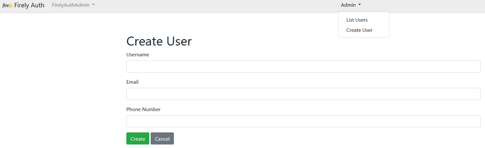

.. _firely_auth_mgmt:

Firely Auth User Management
===========================

When using the SQL Server user store, you can manage the users therein with a command line utility called the 'Firely Auth Management app'. This can be used both interactively from the commandline and automated from a script or devops pipeline.

.. _firely_auth_mgmt_exe:

Executable
----------

The app is included in the :ref:`binaries <firely_auth_deploy_exe>` of Firely Auth.
You can invoke it with:

.. code:: Powershell

    ./Firely.IdentityServer.ManagementApp.exe

.. _firely_auth_mgmt_params:

Commands and parameters
-----------------------

For brevity here is a full list of the available commands and their parameters.

The parameter `--connectionString` or `-cs` is used multiple times. Use the same connectionstring as in :ref:`firely_auth_deploy_sql`.
You can set the connectionstring in an environment variable ``FIRELY_IDENTITY_SERVER_USERS_CONNECTION_STRING`` so it doesn't need repeating.

The parameter `--passwordHashIterations` or `-hi` is also used multiple times. Use the same passwordHashIterations as in :ref:`firely_auth_settings`.
You can set the passwordHashIterations in an environment variable ``FIRELY_IDENTITY_SERVER_USERS_PASSWORD_HASH_ITERATIONS`` so it doesn't need repeating.

- ``./Firely.IdentityServer.ManagementApp.exe```

  - ``-?, -h, --help``: Show available commands
  - ``users``: invoke user management

    - ``list``: list all users
      
      ``-cs, --connectionString``
      
      ``-hi, --passwordHashIterations``

    - ``create``: create a new user, specifying username and password
      
      ``-u, --username``: username
      
      ``-p, --password``: password - enclose in double quotes if it contains spaces.
      
      ``-cl`, --claim <name=value> [<name=value> ...]``: list of additional claims for this user, see 'AdditionalClaims' under :ref:`firely_auth_settings_userstore`
      
      ``-cs, --connectionString``
      
      ``-hi, --passwordHashIterations``

    - ``delete``: delete a user so the user no longer has access
      
      ``-u, --username``: username
      
      ``-cs, --connectionString``
      
      ``-hi, --passwordHashIterations``

.. _firely_auth_mgmt_password:

Password requirements
---------------------

The password for a new user must conform to all of these requirements:

- at least 6 characters length
- at least 1 lowercase character (a - z)
- at least 1 non-alphanumeric characters
- at least 1 uppercase character (A - Z)

.. _firely_auth_mgmt_examples:

Examples
--------

For all examples you need to provide a connectionString. It is easiest to set this upfront in an environment variable:

.. code-block:: powershell

    $env:FIRELY_IDENTITY_SERVER_USERS_CONNECTION_STRING = "Server=localhost,1433;MultipleActiveResultSets=true;Database=firely_auth_store;User Id=<db_user>;Password=<db_user_password>;Encrypt=True"

List the users in the database
^^^^^^^^^^^^^^^^^^^^^^^^^^^^^^

.. code-block:: powershell

    ./Firely.IdentityServer.ManagementApp.exe users list

Create a new user in the database
^^^^^^^^^^^^^^^^^^^^^^^^^^^^^^^^^

.. code-block:: powershell

    ./Firely.IdentityServer.ManagementApp.exe users create -u bob -p 1P@ssword -c patient=Patient/bob

Try to issue the same command again to see that a user with the same name is rejected.

Delete a user from the database
^^^^^^^^^^^^^^^^^^^^^^^^^^^^^^^

.. code-block:: powershell

    ./Firely.IdentityServer.ManagementApp.exe users delete -u bob

Change a user's password
^^^^^^^^^^^^^^^^^^^^^^^^

There is no function to change a user's password directly. Instead delete the user and recreate it with the new password and any claims.

.. _firely_auth_mgmt_sso_user:

Creating password-less users in the UI for SSO
----------------------------------------------

For SSO implementations you need password-less users in order to authenticate with a remote service. These can be created with a few extra steps in the UI of Firely Auth.
First, it is necessary to log into Firely Auth as an administrator. For this you need to log in with ``FirelyAuthAdmin`` as a username and use a password that you specify in the root of the Firely Auth appsettings.json file, you will need to add the following line:

.. code-block::

  "setadminpassword": "<admin password>",


Alternatively, you can set the admin password during startup of Firely Auth:

.. code-block::

  dotnet Firely.Auth.Core.dll --setadminpassword=<admin password>


Next, you can navigate to the admin portal and create a password-less user there:


