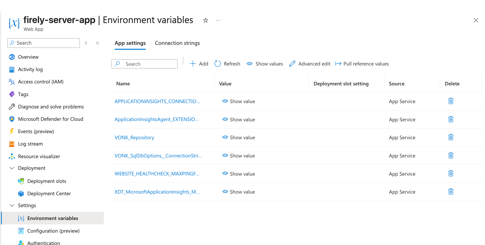

.. _azure_webapp:

Firely Server deployment on Azure App Service
=============================================

In this section we explain how you can deploy Firely Server in the Azure cloud. 

Getting started
---------------

Before you can run Firely Server, you need to request a license and download Firely Server. See step 1 of :ref:`vonk_basic_installation`.
 
Deployment
----------

#. Go to Azure (https://portal.azure.com)  and create a web app:

   .. image:: ../../images/Azure_01_CreateWebApp.png
      :align: center

#. Choose a name for the webapp, we will use the placeholder `<firely-server-app>`, fill in an existing resource group or create a new one, unselect the unique secure hostname, select Linux for the operation system (OS), use `.NET 10` for the runtime stack and choose a region close to you:

   .. image:: ../../images/Azure_02_ChooseName.png
      :align: center
      :width: 760px

#. Configure `Azure App Service Health Checks <https://learn.microsoft.com/en-us/azure/app-service/monitor-instances-health-check?tabs=dotnet#enable-health-check>`_ to target the /$liveness endpoint. This ensures the app has enough time to load conformance resources and start properly. Otherwise, Azure may automatically restart the app before initialization completes. See :ref:`$Liveness <feature_healthcheck>` for more information.

#. Download the latest Firely Server release from https://fire.ly/products/firely-server/.

#. Add the trial license file (firelyserver-trial-license.json) to the downloaded firely-server-latest.zip by dragging the license file into the zipfile.

#. Create a file called appsettings.json with the following content and add it to the zip file:

   .. code-block:: json

      {
        "License": {
          "LicenseFile": "firelyserver-trial-license.json"
        },
        "Hosting": {
          "HttpPort": 8080,
          "ReverseProxySupport": {
            "Enabled": true,
            "TrustedProxyIPNetworks": [
              "0.0.0.0/0"
            ],
            "AllowAnyNetworkOrigins": true
          }
        }
      }

   This configuration file configures Firely Server to use the provided license file, to listen on port 8080 (the port used by Azure Web Apps for Linux) and to support reverse proxy scenarios.

   .. note::
      If you want to use another kind of repository than the SQLite repository, you can add the settings for either :ref:`SQL Server<configure_sql>` or :ref:`MongoDB<configure_mongodb>` in this appsettings.json file.

#. Open a terminal and use the Azure CLI to deploy the zip file to the web app. Use the following command (replace the placeholders with your own values):

   .. code-block:: bash

      az webapp deploy \
         --resource-group <resource-group> \
         --name <firely-server-app> \
         --src-path <path-to-zip-file> \
         --type zip --clean true --restart true

   After deploying the .zip file using the Azure CLI, verify that all content has been extracted into the top-level webroot directory.
   
   .. image:: ../../images/Azure_03_WebRoot.png
      :align: center
      :width: 900px

#. Open a browser and go to the site ``https://<firely-server-app>.azurewebsites.net/`` . This will show the Firely Server home page.

Change database
---------------

In this example Firely Server is using a SQLite repository. If you want to change it to another kind of repository then you could change that on the page Application Settings of the Web App. Here you can set :ref:`Environment Variables<configure_envvar>` 
with the settings for either :ref:`SQL Server<configure_sql>` or :ref:`MongoDB<configure_mongodb>`. For example for SQL Server it will look like this:

.. _azure_webapp_envvar:

Starting Firely Server with environment variables
-------------------------------------------------

In an Azure Web App, the *App settings* of the Web App (under *Settings* > *Environment variables*) are passed to Firely Server as environment variables. If you have your configuration in a file, e.g. ``firely-server.env`` exported by the Guided Setup, you can upload all variables in one go with the Azure CLI. See :ref:`configure_envvar_file` for the format of the file.

.. note::
   On a Linux Web App, app setting names can't contain a ``:``. Always use ``__`` as the separator, e.g. ``VONK_SqlDbOptions__ConnectionString``.

The Azure CLI expects a JSON file, not an env file. First convert ``firely-server.env`` to JSON, then apply it:

.. code-block:: powershell

   $settings = Get-Content .\firely-server.env |
     Where-Object { $_ -match '^\s*[^#\s][^=]*=' } |
     ForEach-Object {
       $name, $value = $_ -split '=', 2
       [ordered]@{ name = $name.Trim(); value = $value; slotSetting = $false }
     }
   ConvertTo-Json -InputObject @($settings) | Set-Content .\firely-server.settings.json

   az webapp config appsettings set `
     --resource-group <resource-group> `
     --name <firely-server-app> `
     --settings "@firely-server.settings.json"

   Remove-Item .\firely-server.settings.json   # the file contains secrets

.. tip::
   For secrets like connection strings, consider `Key Vault references <https://learn.microsoft.com/en-us/azure/app-service/app-service-key-vault-references>`_ instead of plain values in the app settings.

Restarting after a change to the env file
^^^^^^^^^^^^^^^^^^^^^^^^^^^^^^^^^^^^^^^^^

After you change ``firely-server.env``, run the commands above again. App Service restarts the app automatically when the app settings change, so you don't have to restart it yourself. Keep in mind:

* ``az webapp config appsettings set`` only adds and updates settings. If you **removed** a variable from the env file, also remove it from the Web App:

  .. code-block:: bash

     az webapp config appsettings delete \
       --resource-group <resource-group> \
       --name <firely-server-app> \
       --setting-names VONK_Some__Removed__Setting

* If you use deployment slots, apply the settings to the slot that you are going to use (add ``--slot <slot-name>``) before you swap.
* The Web App restarts, so Firely Server is briefly unavailable, and loads its conformance resources again on startup. The health check on ``/$liveness`` (see step 3 of `Deployment`_) gives it time to start.

More information
----------------
About Azure zip deployment: https://learn.microsoft.com/en-us/azure/app-service/deploy-zip?tabs=cli

.. important::

   * We recommend using either SQL Server or MongoDB as both the data and administration repositories when deploying Firely Server as an Azure Web App in Production due to autoscaling and file handling. See :ref:`Database configuration<configure_db_vonk>` for details on configuring these databases.

   * We recommend using slots for deploying new versions of Firely Server to minimize downtime. See `Azure App Service Deployment Slots <https://learn.microsoft.com/en-us/azure/app-service/deploy-staging-slots?tabs=dotnet>`_ for more information on how to set this up.
  

